# 25 Famous Introverts You Didn’t Know About

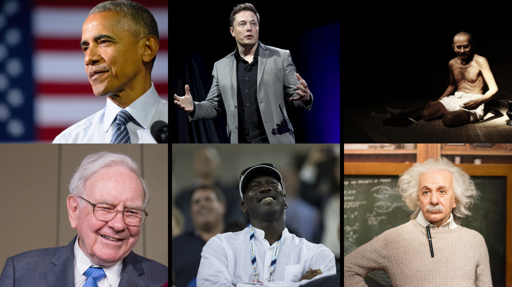

Commonly seen as this shy and socially awkward individual, there is more to an introvert than he or she is given credit for. In fact, famous introverts can actually be found anywhere and everywhere, from the arts to the political arena. They might end up devoting their entire lives to science, the study of technology or the pursuit of civil rights. What truly separates an introvert from the rest of the population is their need to have some time alone in between social appearances. They are extremely sensitive, though not necessarily moody. They are notoriously creative and idealistic and relentlessly determined to achieve what they had set themselves to achieve. They are dreamers and that is what ultimately makes them stand out in a crowd. It is therefore not surprising to find a few of them among your favorite celebrities or public figures. What might end up surprising you is really how all of these quiet personalities turned out to have such a big impact on us all.

## Albert Einstein

One the most famous scientists in history, credited to have changed the way we see the world today. Among his scientific breakthroughs is his famous theory of relativity and his revolutionary E = mc² equation which essentially changed our basic understanding of the universe and the laws of physics.

He was a well-known introvert, someone who recognized monotony and solitude as two of the most essential stimulus to the creative mind. Growing-up, he was an average student who experienced speed challenges and who hated reciting lessons and adhering to rules. He was often found in solitary corners, reading and studying by himself. He insisted on questioning everything around him, and famously valued imagination over knowledge.

## Elon Musk

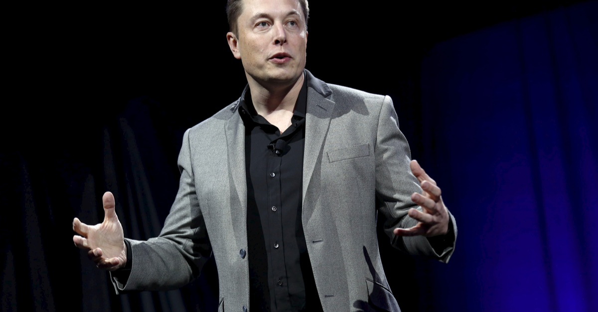

Based on his personality alone, Elon Musk clearly fits the INTP type, as an intuitive thinker and an introvert perceiver. He's someone who takes more interest in his own inner world of thoughts and ideas than the external world of people and places. He isn’t a natural public speaker. He’s rather stiff while presenting ideas on stage and he never modulates his voice in order to better engage with the audiences. He speaks in a monotome, as if that’s the type of communication is more accustomed to. He always tries to listen without interrupting. His ongoing curiosity and thirst for knowledge would also be enough to peg him as an introvert.

## Rosa Parks

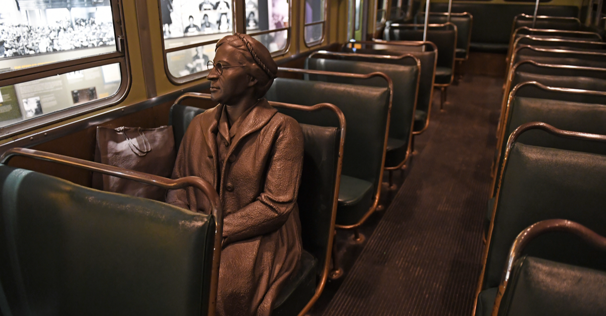

Often described as shy and reserved, today Mrs. Parks is mostly remembered for her extraordinary acts of passive resistance, as when she refused to give up her seat to a white passenger while riding a bus in Montgomery, Alabama. She is mentioned in Susan Cain’s book “Quiet: the power of introverts in a world that can't stop talking” and she is often admired for her radical humility and quiet fortitude.

## Eleanor Roosevelt

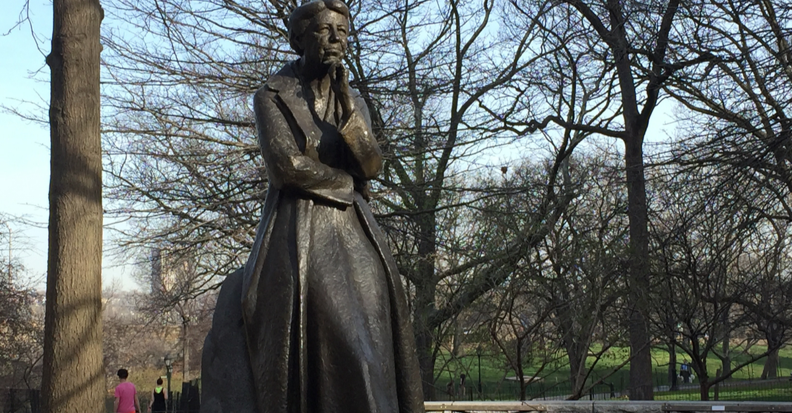

Her biographers describe her as both shy and withdrawn and Roosevelt herself described her shyness as nearly pathological and abnormal. She never did feel very self-confident growing-up and would often refer to herself as an ugly duckling or a solemn child. Her mother used to call her “Granny” for her taciturn disposition, which left her daughter feeling all the more self-conscious and out of place. It wasn’t till after her marriage that she threw herself into public speaking with an enthusiasm that bordered on compulsion. It was as if she had just unleashed the flow of words that she had kept to herself throughout most of her younger years.

## Bill Gates

The founder of Microsoft and one the world’s healthiest individuals, Bill Gates is a vocal supporter of all the qualities inherent to being an introvert. He got in to Harvard to study Law and to please his parents, but soon dropped out so he could engage with his obsession for a little-known technological gadget called the computer. He started his own company and worked tirelessly for 16 hours a day so as to make sure he personally checked every line of code that went into his software system. He struggled against critics and tech companies that wouldn’t invest in his company, but still he stuck to his vision and to what he knew had the potential to be revolutionary and far-reaching.

## J.K. Rowling

The author of the Harry Potter books started out her writer’s journey while riding on a train. Back then, she was far too shy to ask a stranger to borrow her a pen, so she resigned herself to staying on her seat, daydreaming. It wasn’t until later that night that she was able to put thoughts to paper. She single-handedly conceived this imaginary self-governed wizarding world with its own set of rules and characters that would captivate generation of readers thereon after.

## Warren Buffet

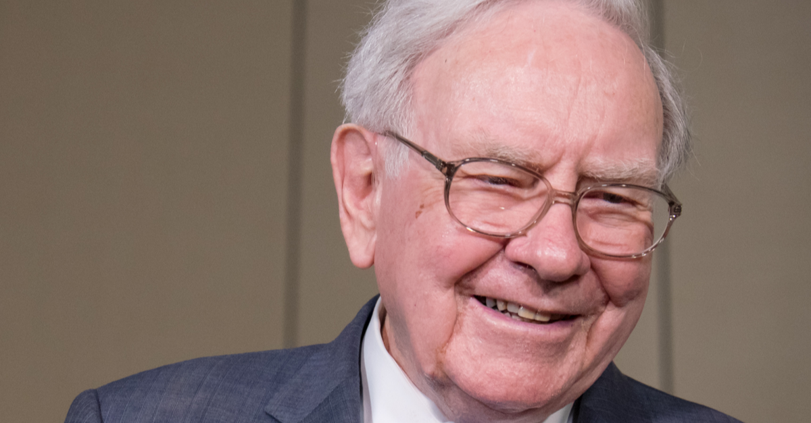

Turns out one of the most successful investors in the world is also a well-known introvert, with more than a few ritualistic tendencies. By his own admittance, Buffet found it difficult to interact with other people and had to put on extra time and effort to better develop his communication skills. He ended up taking a self-improvement on how to win friends and influence people and owns part of his expertise to his solitary study habits. He is a perfect example of how an introvert can use his traits to not only his advantage but also to the benefit of those around him.

## Mahatma Gandhi

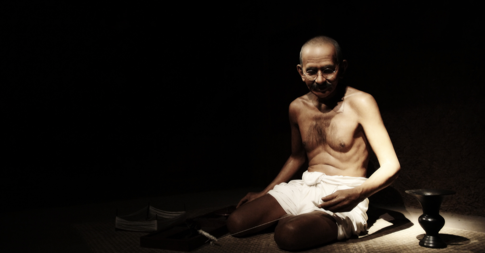

A notorious peacekeeper, Gandhi would also become a symbol for non violent resistance and the leader of the Indian independence movement. In his autobiography, he revealed he used to avoid other’s company while growing-up and would eventually see that shyness as a liability that he would later try to overcome. He did always keep a willingness and ability to look inward, something which would end up providing a huge source of comfort and inspiration to others. Gandhi himself learned to draw strength from his quiet and restrained personality in his constant search for truth and inner peace.

## Michael Jordan

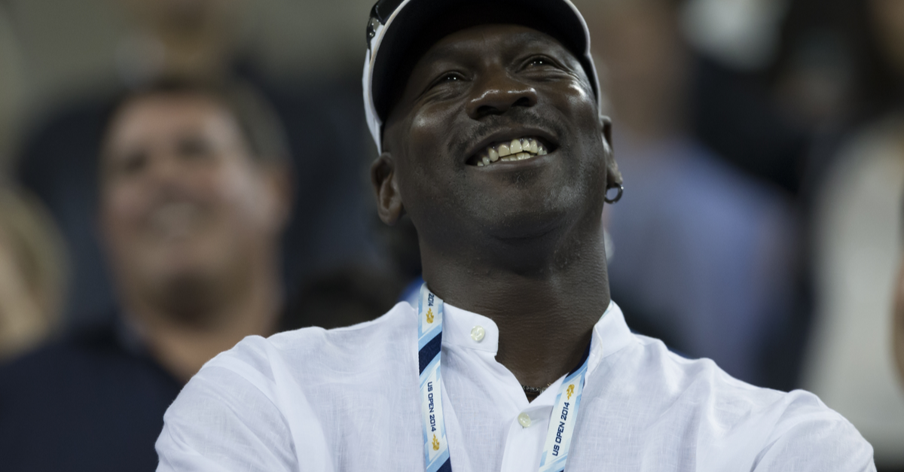

It might surprise some that he was in fact a well-known recluse and a man who was very much aware of his weaknesses. So much so that he would train himself to turn his weaknesses into strengths. He is ambitious, hard-working and constantly looking for ways to keep busy. His relentless energy has become an inspiration for other introverts, as that of someone who has managed to thrive in a career in the spotlight.

## Meryl Streep

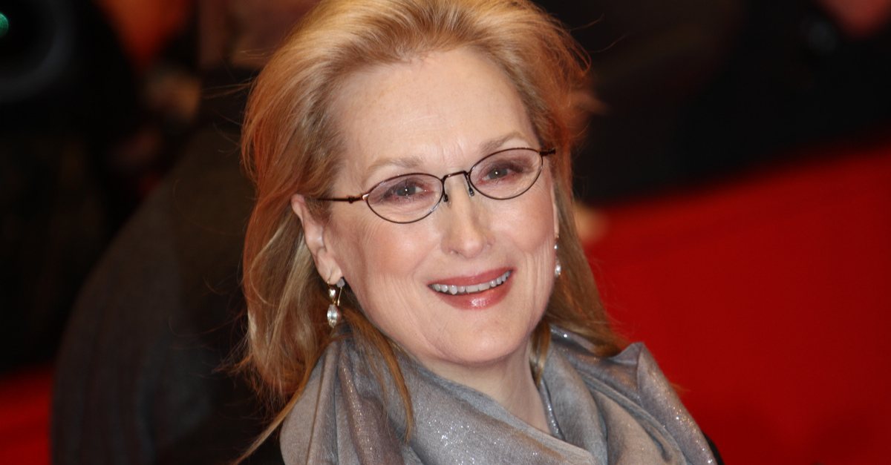

Actors are amongst the most famous introverts on this list. Meryl Streep is one of them. She is known to enjoy her quiet evenings spent at home more than making an attendance at some prominent social event. She is also relentless at work, devoting hours of research and preparation to each and every single one of her roles, coming close to near perfection when delivering her lines. Her efforts earned her a place as the most nominated actor in history and as arguably one of the greatest living actresses in Hollywood. She is still well-beloved in her community, having worked over 30 years in the film industry.

## Audrey Hepburn

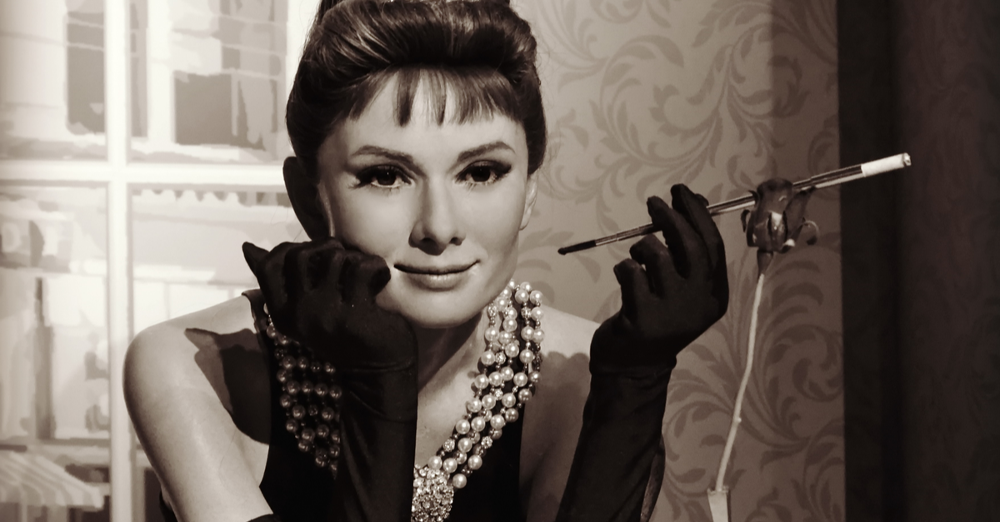

Yet another actress makes the list. In spite of her popularity, the actress greatly enjoyed spending her time away from the spotlight taking long walks outdoors and simply being by herself. She is one of only 12 people in the world to have ever made it into the EGOT club, having won Grammy, and Emmy, and Oscar to her name. She was very found of solitude, calling it a perfect way to recharge. She was an avid reader and an humanitarian and her legacy live on, still today.

## Abraham Lincoln

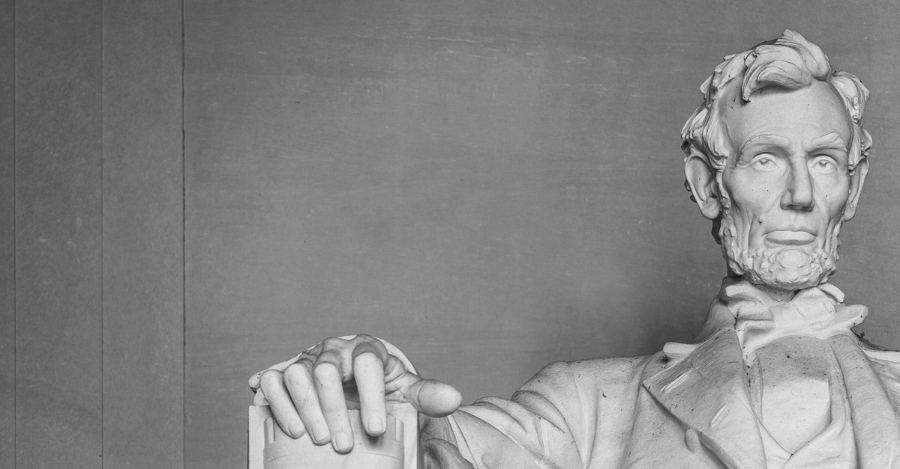

The 16th president of the United States started out as a self-educated lawyer who set up to change the world politics. He was an avid reader and listener, adept at using the words of his opponents against them. His humble beginnings taught him all about hard work and perseverance and his rise in politics owned a great deal to his literacy skills and his ability to empathize with his fellow men. He would seldom speak, but whenever he did, everyone was sure to pay attention to his timely words.

## Mark Zuckerberg

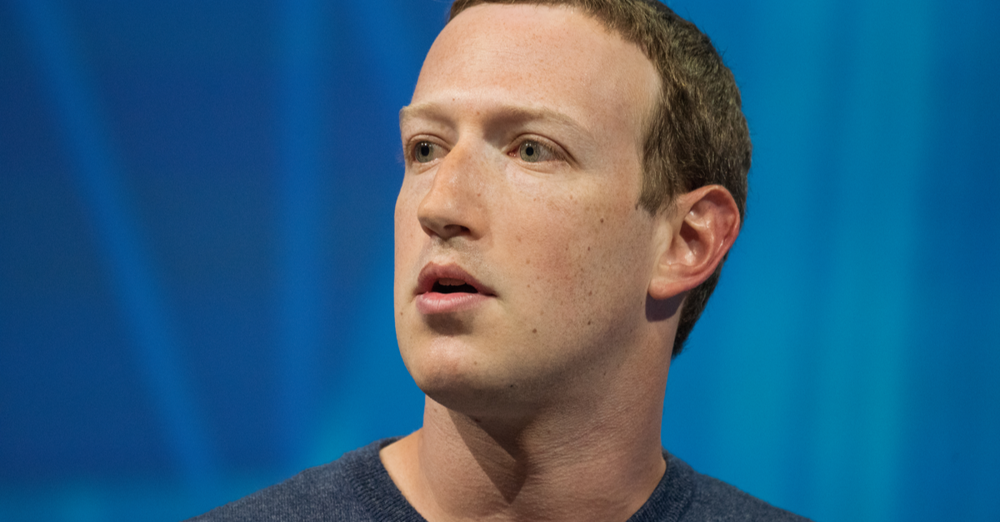

The co-founder of Facebook lack of skills is on full display on the film adaptation of a darker period in his life. The film, which follows Zuckerberg’s college years, also reveals a far more awkward and clumsy side of a man who would become a billionaire by the age of 23. Ironically, it was his own self-awareness which led to develop a website that would bring people together and ease up the art of sharing and having a conversation. As with most introverts, Zuckerberg is incredibly knowledgeable and self-disciplined and an avid student of human nature.

## Amy Schumer

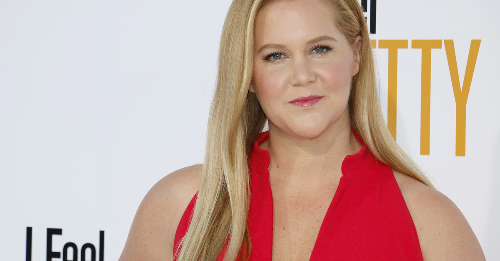

Arguably one the most surprising entries on this list and one which undoubtedly work for those introverts skeptic of being able to sustain a high-profile career. Schumer is an actress, comedian and a producer who once struggled with her own inhibitions until she finally decided to accept them as part of her own unique and quirky personality. In between stand-up routines and film roles, she greatly enjoys taking time for herself and has learned to accept herself through humor, something which has led to achieve a great level of success in her own right.

## Oprah

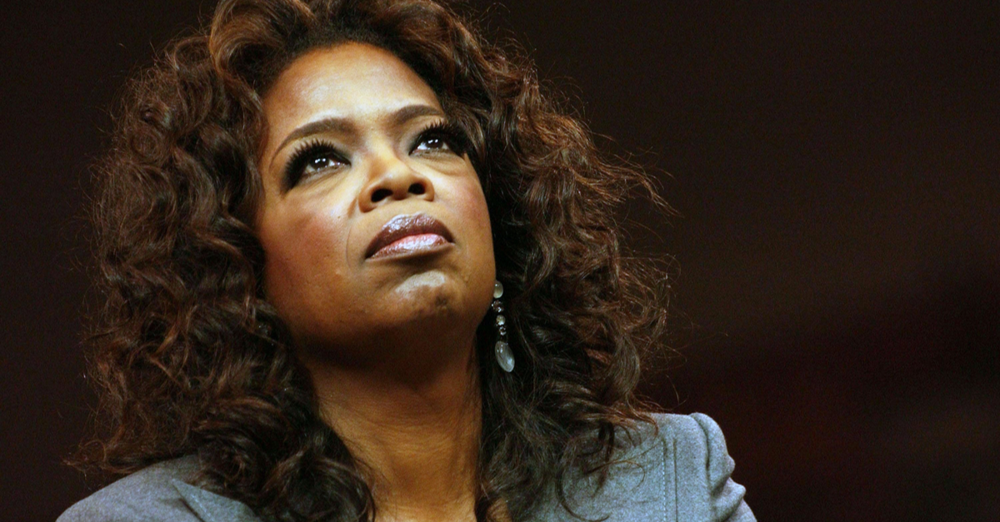

A beloved figure of the small screen, Oprah has achieved national success through incredible hard work and her ability to empathize with others. Her status as a modern media mogul has never diminished her passion for listening and showing kindness to others. She is well-known as an avid bookworm and for her candor and sincerity which she frequently displays on national television. On her most candid interviews, she’s revealed to struggle in social situations, often needing to quickly retreat to the bathroom just so as to a few moments where she can be alone and fully ground herself.

## Steven Spielberg

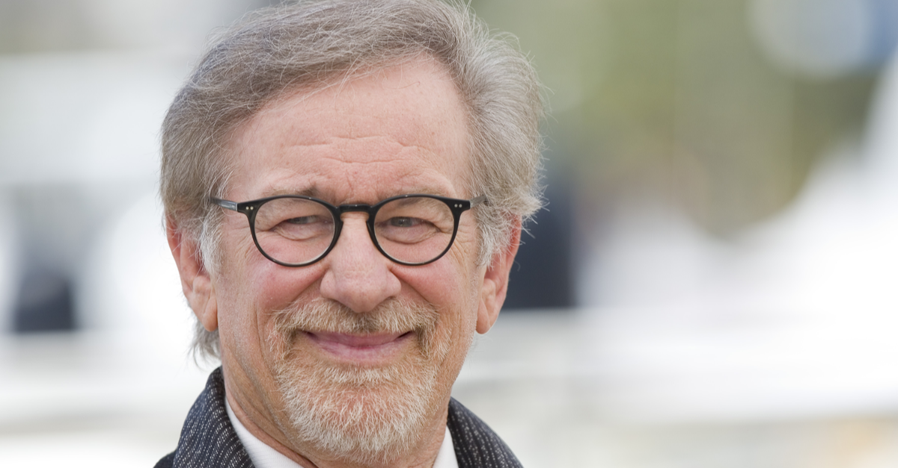

Although it might be surprising to some, it might less surprising for cinephiles who are deeply familiar with the director’s world. Spielberg’s love for tech and storytelling is something that has been with him since childhood and he has since built a successful career on his passion. His love of cinema would also help tag as an introvert, just by accounting for the many hours he must have spent in front of a tv screen. Spielberg himself has written about his own discomfort in social situations and coming to terms with own sense of belonging and community. That might be perhaps why his heroes are always outsiders themselves.

## Sir Isaac Newton

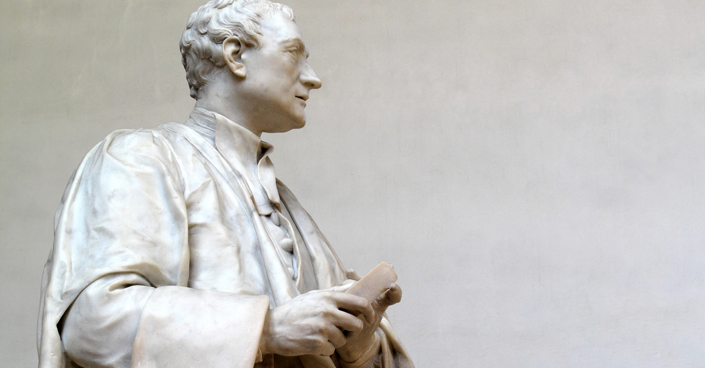

A mathematician who first formulated the laws of motion and universal gravitation and also a deeply introverted individual who was fiercely protective of his privacy. He was deeply insecure and frequently gave in to fits of depression and outbursts of violent temper, acting as if he were somehow constantly under threat. He held a grudge against Gottfried Leibniz who he claimed stole his calculus discovery. He was also incredibly charitable, specially towards the end of his life and is remembered fondly, both for his work and his kindness and generosity.

## Charles Darwin

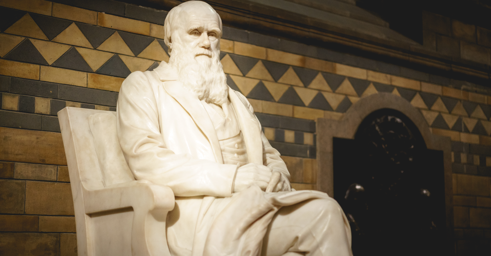

The father of evolution was probably better known for the uproar that followed the publishing of his book on the origin on species than for his quiet research habits, though Darwin had always been recognized as an introspective creature. He was known to have bouts of insomnia at times and he went through a particularly dark period after the untimely death of his daughter. He was deeply curious about the world around him and eager to understand it. Overall, he was depicted as a humble and kind individual whose ideas might have just been ahead of his time.

## Dr. Seuss

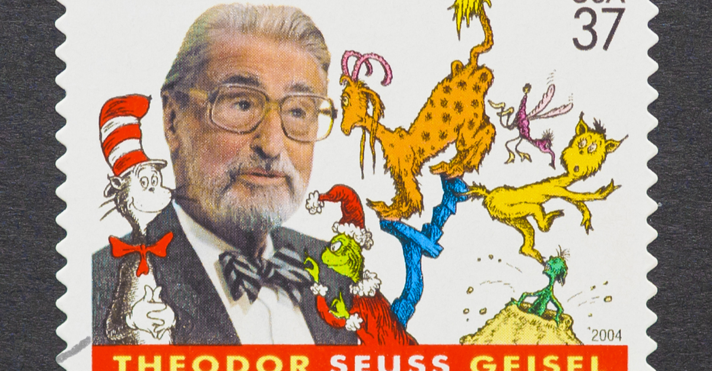

The famous children’s author was always reluctant to meet his young readers as he was afraid that they would be disappointed at just how quiet he really. He spent most of his days alone, scribbling away in the private bell tower at the back of his house in La Jolla, California, tucked away in his private studio, surrounded by walls covered with sketches and drawings. He would happily leave his characters to do all the talking for him.

## Frederic Chopin

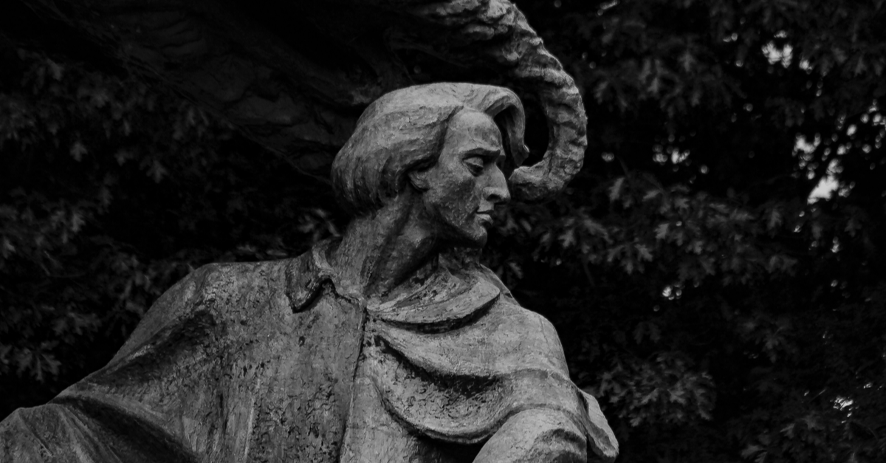

The world renowned composer was so introverted he only gave about 30 public performances throughout the course of his lifetime. He mostly enjoyed performing for his small group of friends and for his students, as he made a living by teaching the piano. His most productive periods coincided with his private moments of solitude and one of his most famous compositions is said to pay tribute to all the quiet sounds of the night.

## Steve Wozniak

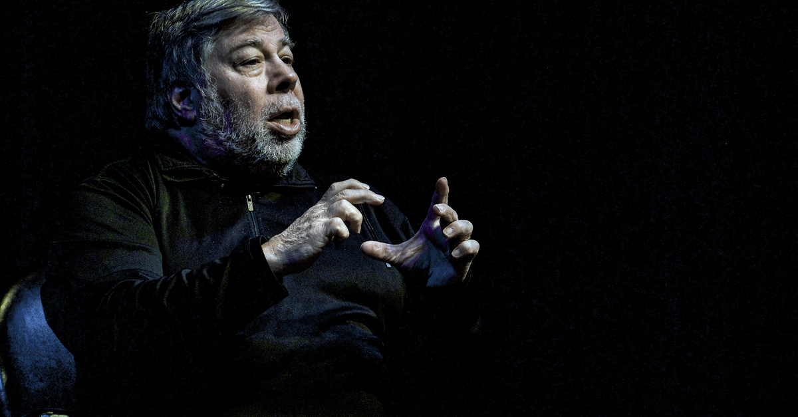

A techie infamous for promoting independent work over team work, has always been an advocate for quiet thinking and solitary working activities. It would then make sense that he would partner up with a famous extrovert in order to proper show off his idea to the outside world. He has shown us both the importance of deep thinking and the value of emotional intelligence and forever changed the face of technology.

## Alfred Hitchcock

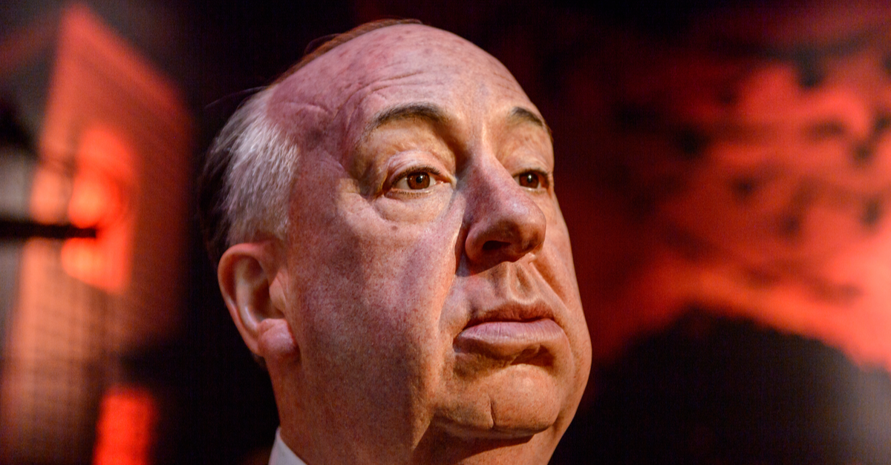

Even though he is often categorized as being eccentric enough, Hitchcock’s trailblazing success has kept him from being fully accepted as the introvert that he really was. Yet Hitchcock’s shows all the traits of a genuine introvert. He was extremely bold and imaginative, for one, eager to learn the rules and then break them. He hardly ever raised his voice, rarely went to parties or showed up any emotion on set. He was very meticulous with his work and demanded the same of his crew. His stories and techniques have deeply influenced the course of film history and cannot be overstated.

## Thomas Edison

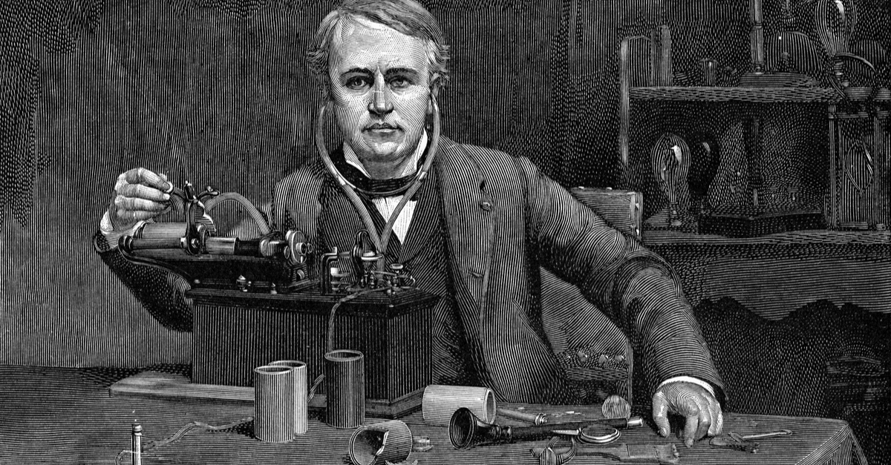

The great inventor wasn’t only a keen observer and an attentive listener, he was also a relentlessly borderline stubborn character who believed failure was but a stepping stone on the way to success. He is credited with saying that genius is one percent inspiration and ninety-nine percent perspiration. He was creative, hard-working and also a man who treasured his time spent alone.

## Barack Obama

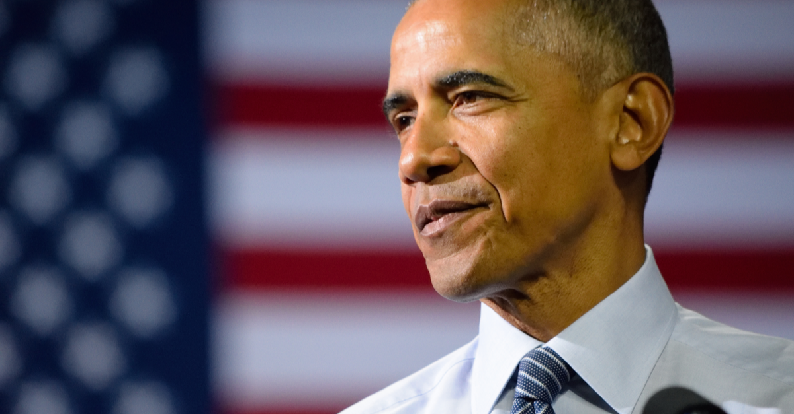

Obama’s introversion is only obvious on one on one interviews, but those who worked closely with him have fond memories of his love of teleprompters and the spoken word. Obama shares many of the traits of the classic introvert. While he was president, he greatly enjoyed studying and preparing his speeches in advance and as since then presented himself as an ambitious, hardworking individual, someone who thinks before he speaks and who has earned the respect and admiration of those around him.

## Elton John

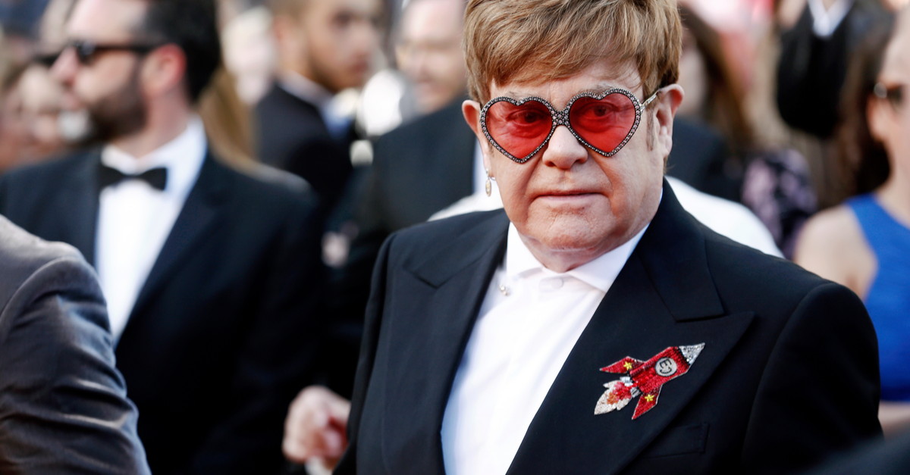

Despite his flashy public persona, Elton John is often characterized as as introvert by his closest friends. Just like a true invert, the musician often needs time alone to recharge both before and after a performance or a social event. He expresses himself through his work. He’s a deep thinker, an empath and the very last entry on this list.

