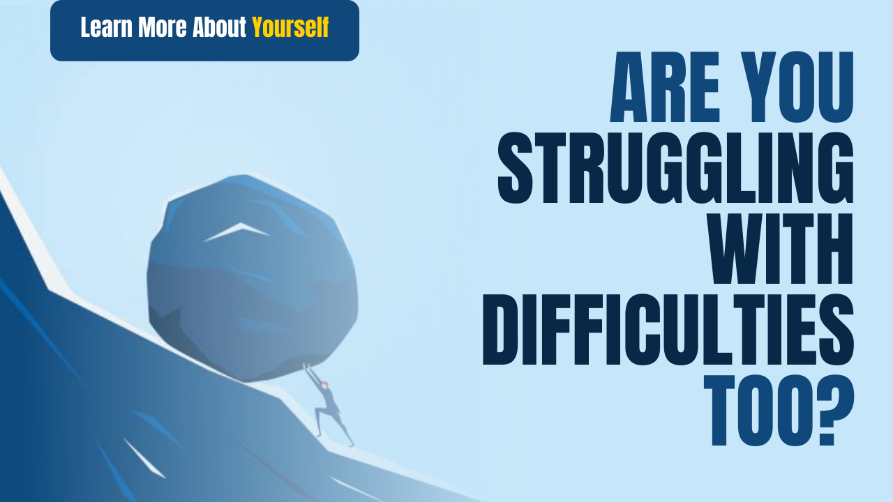

# Are you struggling with difficulties too?

Time is passing, but the phase of troubles is not ending. Is the same happening to you? So do not be worried because you are not alone in this path.

Everyone has their own problems. If a person is worried about his job, then he is upset because of not having any job.

If someone is unhappy with their misery, then some person is sad with the happiness of the neighbor. Some are physically unhappy, some are mentally unhappy.

As technology continues to expand, the number of problems is increasing. In olden times people were not so sad as today. The people who are suffering from depression and depression today hardly had such terrible diseases in the old times. Where people had happiness and peace in ancient times. It is the same sorrow and unrest in this modern period, no matter how much money people have or do not have. Every person has grief in different forms.

Everyone thinks that my neighbor or my friend is happy and I feel the same. I have an eye disease, sometimes my eyes ache and irritate so much that I get very upset then I feel that and my friends are so happy with their eyes, they don&#39;t have any problem. He is not happy, he is happy, but it is wrong because every person is suffering from different diseases, some are physically disturbed and some are mental.

Physically, a person may have hearing problems, someone&#39;s headache, someone&#39;s ringworm itch, someone&#39;s body ache, someone&#39;s stutter, someone&#39;s walking, someone&#39;s obesity. , Some are thinner, Some are longer, Some are dwarf, Some have eyes problem, Some are allergic. There are many such diseases, God has given different diseases to each person.

Mentally, a person may become stressed and depressed. There can be many reasons for this, there may be a loss in business, boss reprimand, sickness of parents, the worry of marriage, not having children, and many other families and business problems.

Your problem may also be one of these problems or it may be different.

Bad times and troubles come in every person&#39;s life. Some people compromise with their troubles and some struggle with their own troubles. Either way, both are right, whether they struggle or compromise because this person&#39;s circumstances decide what he has to do.

It is said that everyone comes at a bad time, some flourishes, some shatters.

This means that bad times always come for a certain period of time. It is always an indicator of your good times. During this time you only need to keep your spirits elevated. This bad time also comes out like new dawn after a dark night.