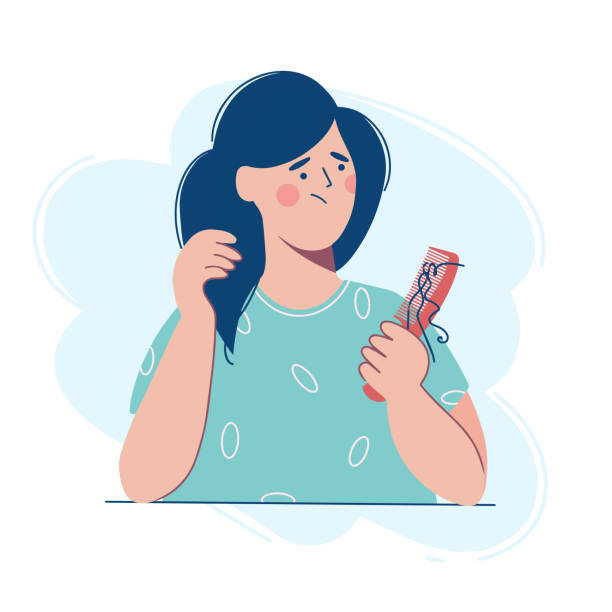

# Best Hair Loss Cures in 2021

Hi and welcome back to [learn more about yourself](https://learnmoreaboutyourself.com/)! Hair Loss Cures are a big problem nowadays. If you don't do Hair Loss Cures, it will increase a lot. That's why we brought Hair damage for you today.

Are you getting a tad thin on top? Maybe your forehead is beginning to move a little higher than you'd like. These are the inevitabilities of aging that affect men and women all over the world. The truth is no one wants to lose their handsome dew. With the ever-popular cosmetic market growing rapidly as ever, there are becoming more and more hair loss cures. The trick, however, is finding the treatment that works best for you. While some individuals may experience rapid hair loss, others may only suffer from a slight thinning on top. Either way, it's time to settle the score with your genetic code and find hair loss cures that work for you.

## Best Hair Damage Cures

This way no one actually knows if you have hair under there or not. Fortunately for me, my mother's father kept a full head of hair. Hopefully, I won't have to deal with hair loss cures at all. However, my brother wasn't as lucky you might say. He rapidly lost his dew, which started at the end of high school. He's one of those fellows who simply said, "The heck with it" and moved on. He's shaved his scalp ever since. Although this routine works for a few, many of us want to keep our soft locks forever.
 
I for one, intend to fight the dilemma of hair loss every step of the way if it should arise. You should do the same. With hair loss cures like Rogaine available in your local drug store, you shouldn't have any trouble hindering the hair damage process. This treatment is actually known for growing hair back. You can acquire it without a prescription and for a fair price.

If you have grappled with the burden of Hair Loss and have not yet encountered any worthwhile hair loss cures, it may be high time to visit a trichologist. A physician that specializes in hair breakage could certainly point you in the right direction toward the best and most effective hair damage cures. Don't let your scalp lose another follicle. It's time to take action. If you're not sure where to start, hop online for immediate answers to your many queries concerning hair damage cures. Keep that snazzy dew and your self-confidence too.
