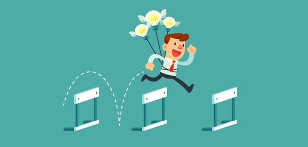

# Best Practical Self-Improvement Tips

Hi and welcome back to [learn more about yourself](https://learnmoreaboutyourself.com/)! Today I am going to give you Best Practical Self-Improvement Tips and I am sure you will apply these tips in your life.

## Let go of your bad habits

For you to live a productive and healthy life, you need to give up your bad habits.Here are some of the most common bad habits that people need to leave :
leave :

1.Excessive drinking
2.tress eating
3.Smoking
4.Nail-biting
5.Being late
6.Consuming junk food
7.Being glued to the TV
8.Hanging out with people who criticize too much
9.Hanging out with unappreciative people
10.Concentrating on the negatives
11.Being in unhealthy relationships
12.Consuming excessive red meat

The consequences of some of these bad habits can be fatal. The good news is that you can either leave them alone or they will give you trouble in your life going forward.

## Always learn from the people around you

Think about your friends, family, and people you admire or inspire.
As human beings, we all have a set of good and bad qualities and we can choose the good qualities of others which is normal.
Spend quality time with your loved ones and learn from their mistakes, experiences, and adventures that will take you further in life. Seek their advice and I am sure they will be happy to help and support you and your relationship will be stronger.

## Start with journaling

nowdays the most effective self-improvement help you can ever come across.

Journaling is a wonderful technique for self-reflection and self-awareness.
Writing down your thoughts and feelings helps you gain clarity and a deeper understanding of who you're, what you would like to do, and the way to achieve it.

Today, journalism is not any longer limited to just pen and paper. In fact, you'll begin a private weblog or download apps like Day One, Diary, and 5 Minute Journal.

## Be Meditate

Meditation can help you become calmer and more mindful. you'll be able to begin with a number of minutes of meditation on a daily basis to check the difference.

You’ll feel liberated, fulfilled, and have clarity. i like to recommend using the headspace app if you’re simply just out.

## Always Commit to your personal growth

you’ll never be ready to improve yourself if you’re not serious about it.

You can only change yourself if you’re committed to it. You know that we are responsible for our own personal development, not your parents.

understand that the path to change and growth may be a life-long process and can require constant efforts.

You might not see immediate results however I guarantee you will within the longer run.

If you liked our Best [Practical Self-Improvement Tips](https://www.oberlo.in/blog/how-to-improve-yourself) article, thank you very much.
