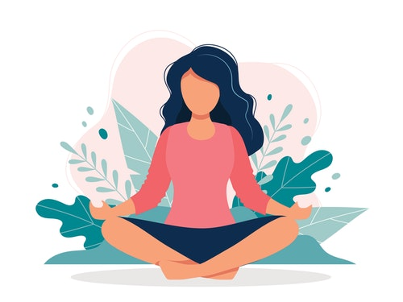

# Best Ways To Practice Mindfulness In Your Daily Life 2021

Hi and welcome back to [learn more about yourself](https://learnmoreaboutyourself.com/)! That being said, mindfulness is often one of the most difficult, however rewarding things to practice and master. [Mindfulness](https://www.mindful.org/how-to-practice-mindfulness/s) is a state of mind that keeps us focused on the current moment, less stressful, and may also bring long-term rewards in the form of better physical health and greater awareness of our impact on several aspects of life.

The following is an easy way to change our mindset and focus on the current moment for the good of us and most of the world.

## Practice Mindfulness

## How to focus on the environment

So, Being conscious of the health of the earth and educating ourselves about however we can create a positive difference can help us stay present. Additionally, The conscious decision to walk or bike near us rather than driving will help reduce pollution which is nice for our health, further as useless oil resources, that contributes to greenhouse gases and global climate change. Instead, we've to use solar electricity. Collectively, our individual preferences will create a difference, and remembering this can help us apply daily mindfulness in our actions.

## How to focus on our purchases

Especially during this covid-19 epidemic, we can become more aware of the things we need. Where we spend our money, and how the goods make it into our hands which can be very helpful to us. You are more aware of the nearest area corner grocery store. The nearest local farmers market, or any small business in your area. They adjust the way some people buy or pattern restaurants. Epidemic lockdown means that some businesses that rely on foot traffic are seeing reduce hours, or changes in services. Such as adding deliveries or seeing curbside pickups that cause more trouble. Thinking about every purchase, its sourcing and the bigger impact can bring our mindset to the present moment.

## How to focus on positivity

This can a difficult one at a time when all of this seems to be happening. A lot of people are sick, lost, or facing low employment which is unique. Because it has never happened on a large scale and family gatherings. Travel Such as canceling or postponing special events that are making it difficult for many people to get home. Studying gratitude, such as keeping a journal of gratitude, can help us build a more positive mindset.

## How to focus on learning how to be mindful

In times like these, if you are having trouble finding your way to Mindfulness, you are not alone. Or a good way to spend time online or on your smartphone is by tapping into the resources provided by the many great mindfulness apps available to you such as this website from which you can read good blogs. Choose one that pays attention to you every day and provides good information, ways to be present, information on how to promote good sleep. And tools to help you regulate your breathing - proven ways to help improve your mental and physical health. These are the best ways in 2021 To Practice Mindfulness In Your Daily Life.
