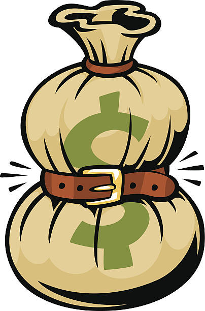

# Big Signs You’ve Outgrown Your Life

## You'll not relate to the people around you

When you begin to understand that you just don't have anything to speak regarding with the people you surround yourself with it’s a positive sign you’ve outgrown your life them. you'll stop enjoying the activities you previously participated in with these people and [communication](best-ways-to-practice-mindfulness-in-your-daily-life-2021) seems like a struggle.

Your friends, family, and others would possibly begin making comments to you that you’ve changed. Be ready that they possible won’t be happy regarding it.

When others begin telling you that you’ve changed it’s a huge compliment! It means you’re growing! Not everyone seems to be meant to be a part of your life forever. It’s alright to release the people you’ve outgrown to maneuver forward along with [your life](https://www.sitbreathelove.com/10-signs-ready-change-life/).

## Everybody around you is changing

On the other hand, another sign you’ve outgrown your life is that if everybody around you is changing!
If your friends and family are creating all types of modifications in their lives and you’re sitting alone on some barstool it’s time to want a listing of your life. Why aren’t you creating positive changes too? You’ve outgrown this recent lifetime of yours thus set some goals and act!

## You’re curious about various things

When you begin to become curious about totally different activities, it’s a sign you’ve outgrown your life. It’s whole normal and healthy to have an interest in new things however once you become curious about activities that vastly deviate from your usual ones it’s a sign that you’re outgrowing your current life. Follow the inclination to interact with new things. It keeps life fresh and exciting!

## You have got a continuing feeling of discontent

You’ve outgrown your life once you begin feeling consistent discontent with it. It’s an enormous sign if you were antecedently content with identical circumstances. Maybe your current life not challenges you in the way it once did. After we don’t feel challenged, life feels material and indifferent.

Feeling longing along with your life is not any way to live. hear that inner voice telling you it’s time to make changes and grow. A good question to raise yourself once you feel discontent is “what would make me happy”.

## You’re tired of your life

You might be tired of your job or career. perhaps you’re bored with your relationships and also the activities you used to love. If your days feel boring, you’re able to shake your life up, It’s one factor to feel bored here and there however being bored daily of your life is an awful thanks to living and a glaringly huge sign you’ve outgrown your life!
