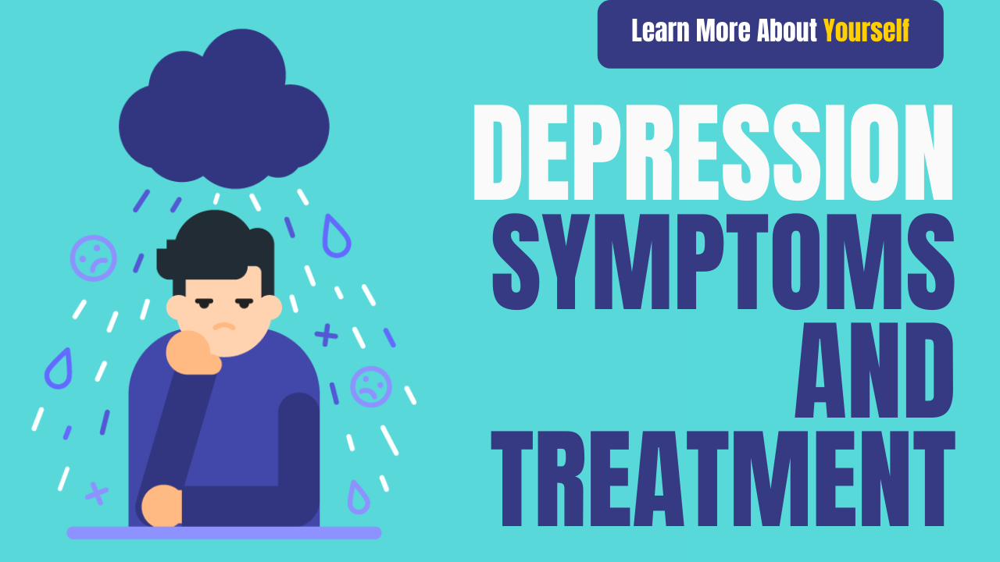

# Depression symptoms and treatment

Friends we are sharing with you Depression symptoms and treatment. tension-free life. Friends, in this post we will tell you what is depression, depression symptoms, depression treatment

Today 90% of people are surrounded by Stress. And sometimes this stress is so great that it can lead to depression. Tension is more dangerous than many terrible diseases and tension is also the cause of most diseases. Tension is dangerous, most dangerous diseases are more dangerous than cancer, AIDS, etc. We all must have heard concern. ). Today, every person experiences depression once in his life. Sometimes this depression is so aggravated that it takes the form of a terrible disease. So let&#39;s know what is depression and how can it be corrected (depression treatment).

In the US, 14.8 million adults suffer from depression and depression is the third leading cause of death of people aged 10–24 years.

## What is Depression?

Sometimes you feel low. Some do not love him, this kind of feeling is called by people, but in reality, it is not depression. Depression is the name of one negative thought coming again and again for several weeks and months and no hope of getting out of that situation is Depression. Negativity is visible everywhere in life. And in that situation it makes you feel so uncomfortable not to be able to do any work properly. For a long time, the state of constant stress and tension changes into depression. depression symptoms and treatment

### Symptoms of Depression

Hunger does not go well

Bodyweight gain or event

No sleep

Rapid breathing

See the negative side of everything

Be irritable

Be scared of everything

The idea of ​​committing suicide

Nobody understands me

Too much sleep or sleepiness

### Depression and Suicide

Because of depression, a person thinks of ending his life so that all his troubles are over. Apart from this, he sees no other way.

Getting out even when the bus or any vehicle is very close.

Telling a close friend now that you will not get the address or not. If you think that any of your friends or relatives are victims of such depression, then show it to the doctor as soon as possible. depression symptoms and treatment

## Why depression occurs?

Due to some unpleasant incident in childhood

Inability to face problems

Bad relationship

Death of a loved one

Wanting a lot of things but not getting them (I have a friend who has 3 girls after 10 years of marriage, but she wanted to have a boy, she went into depression when she was not a boy)

## Depression Treatment at home

1. Keep yourself Busy Creatively as much as possible. It has been said that the empty mind is the house of the devil. And more negative thoughts come to mind

2. If we regular Yoga, Meditation, then the state of stress becomes 50% work.

3. If there is no need to sleep in a state of stress, do not resort to medicine and lie downplaying soft relaxation music, in some time the sleep will come

4. If you are under more stress then you cannot meditate at that time. So count 1-2 to keep your mind calm. Keep doing this after a while. You will find comfort in no time.

5. Believe In God - There is also power over you and should pray this after assuming this. Accept the fact that you cannot control everything according to yourself

6. If you do not accept your problem as your friend or someone you know, then think of what advice I would give if my friend asked for a solution to this problem. . Because sometimes we get so caught up in problems that we cannot think of solutions. But if we still cannot find a solution to our problem, then soon take a suggestion from someone like whom we have faith.

7. Stop any problems before they grow.If you feel that your child has become friends with the wrong boys, talk to him immediately and do not convince him not to fight at home unnecessarily and that our son cannot do anything wrong.

You are very upset with the new boss in your office. You are feeling that you will not be able to stay in such a place for a long time. So plan to switch jobs soon. Why you will be frustrated after taking too much time, which will disturb both your personal and professional life, and searching for a job at that time will increase your tension.

8. Live in Present - If we see, then we will get 90% of our problems related to the future or past. And in the future, only 5% of it comes into trouble, but the rest of our mind makes up its own thinking. So try to stay in the moment.

9. Motivational Quotes, Stories, These will surely fill you with new energy during the day.