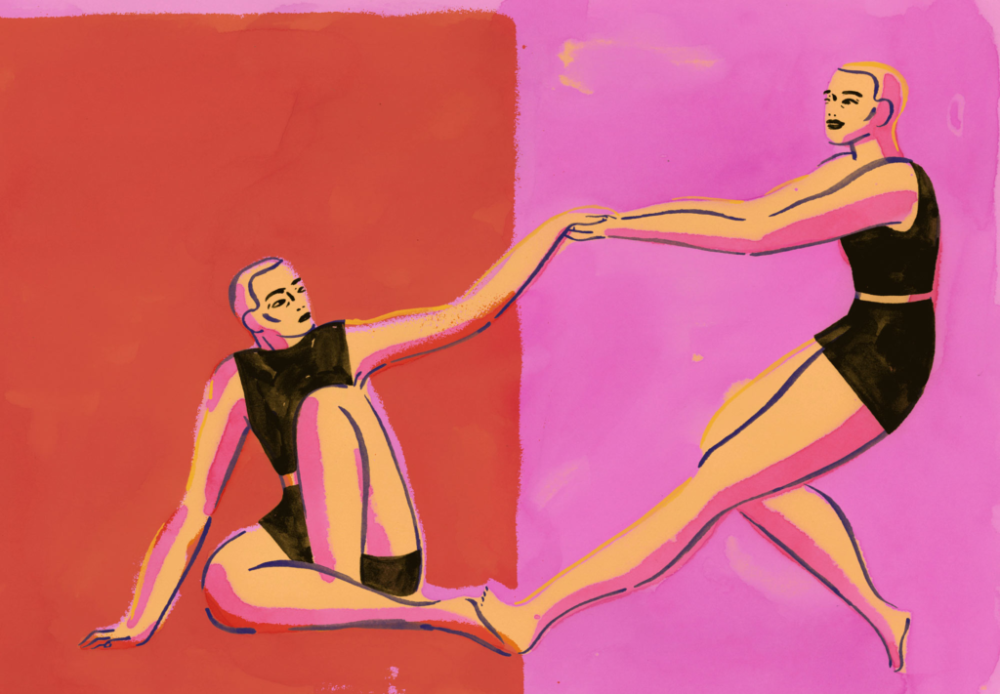

# Enhance Your Self-Esteem with Positive Ways

So, [Enhance self-esteem](https://www.skillsyouneed.com/ps/self-esteem.html) isn't a one-day thing. It needs regular practice and patience. there'll be ups and downs in your life, and lots of times there'll be a problem of low self-esteem. But, it's only you who is responsible to make yourself understand that you just are a good looking, unique, and talented creation on this planet earth.

**1.** Always stop comparing yourself with others: Always comparing yourself with someone kills self-growth and creates self-doubt. Once you compare yourself with the people around you, you begin to doubt your abilities and it hinders your overall growth. So, always accept yourself and you move on.

**2.** Get your body moving: Exercise not only helps to tone your body but however it also helps to enhance the focus in your life by achieving small goals. exercising regularly by setting goals helps to boost your [self-esteem](how-to-boost-self-esteem-with-positive-ways), and cause you to realize that you just are capable of achieving anything you desire for.

**3.** Raise your voice and say NO: It’s okay to say NO if you think that, the situation or the person isn't right for you. By doing this, you're making yourself open to more smart opportunities and also the things which you're willing to try and do the most.

**4.** Be kind towards yourself: Shower love and affection to yourself first, before thinking about others. pamper yourself with luxuries and good food. take care of your body and most importantly, your inner self, and be happy.

**5.** Smile please: Smiling could be a nice stress reliever,  and it helps to develop a positive relationship together with your inner self. So, always wear that smile every time on your face.
