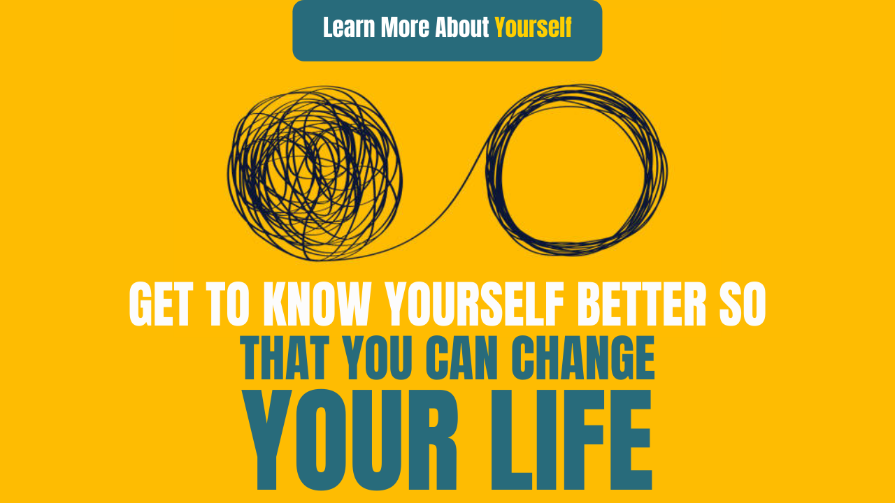

# Get to know yourself better so that you can change your life

**&quot;Knowing yourself is the begging of all wisdom&quot; - Aristotle**

In this famous quote of Aristotle, very deep things related to life and life are gone. All of us have understood in our mind that whatever is the source of wisdom, it will come from outside. It will come from the thick and deep things of a big writer.

By listening to a big spiritual guru, motivational speaker daily and reading the Athavakra Gita and Bhagavad Gita, we will get the next level of wisdom, then it is not so, by doing this you will definitely get the knowledge of good or bad, but to follow or not Doing depends only on you. Get to know yourself better, so that you can change your life,

Unless a person knows himself well. Not familiar with your True self / Nature, as long as it is useless. Petrol in a diesel car is similar to putting diesel in a petrol car.

So let&#39;s start, and try to find out, those paths through which we can know ourselves in a good way.

**&quot;To truly know yourself is the most important skill you can poses ever.&quot;**

When we become aware of who we are, then we come to know easily what is necessary for self-improvement?

When we get to know in which field our true self performs well, then finally we are able to understand the purpose in a better way than before and create a big impact in this world.

Now we try to know, all those techniques with the help of which we can discover our true self, we can discover ourselves and understand ourselves better which is the most to do any task. Are necessary.

## 1. Be quiet

There is already a lot of noise around us. With so much negativity, vibes, and vibrations of the mind change.

We put a lot of our energy and time on social media and our mobiles, it does not bring much improvement in us, but we lose a lot of it and we would create noise inside it. is. To avoid this, it is very important to remain calm and seek peace.

If we see in our life, there are two types of noise, one is external noise. We cannot control what we want, external noise is outside our control.

The second is internal noise. Which is called inner noise in English.

This inner noise is increased by external noise, but there is one thing, this inner noise can be controlled. Once the inner noise subsides, the external noise does not affect us that much. So it is very important to remain calm at the inner level, then we can achieve our true self easily and directly.

In the Bhagavad Gita, this stage is called Sithapragya.

## 2. Understand who you really are, not who you want to be.

I knew little about the world of spirituality from childhood, my grandmother&#39;s influence was on me. After that, the age increased a lot. You can understand like this, I have been removed from the home, I am on the way, the destination is yet to be discovered.

I came to know about Maharishi Ramanan after learning lightly from here and there. The wonderful theory of &quot;Who am I&quot;, given by Maharishi, is all the most relevant in today&#39;s world. We have all come to this world, are living a life, have come into this existence, it would have become the most important. is. Being aware of its reality. What we want to be is just an illusion, we can make our life easier by realizing what we really are, experiencing a peaceful and happy life beyond many kinds of worries.

## 3. Redesign your past mental representation

From what has happened to us yesterday, we have made it today and from what will happen to me today, my future will be decided by that.

&quot;Today is the tree which is seeded in yesterday.

And Future will be shaped by Today &quot;

We have nothing like the time machine so that we can correct the mistakes made in our past. But we can beautify our past by changing our way of thinking.

By doing this, we will finish all the regrets towards the past and we can design our future according to our inner self and true self. And can give a better dimension and true shape to your life.

I will tell here some ways by which you can change your past mental representation.

First of all, make a long list of all the things that you wanted them to be.

Make a list of all the things that have happened that you did not want to happen.

In the first list, you see, what is something that was not done in the past, which you can do in the present. If there is something like that in that list, then you do it again.

**Doing so will eliminate regrets and boost your satisfaction.**

Now, look at the second list, the things that happened, which you did not want. Has anything good happened to him? What has brought some positive change in your life? For that, you once put your hands on the Universe and say &quot;thanks&quot;.

## Always keep one thing in mind

&quot;It is very good if it is in your mind and if it is not, then it is even better because the universal decision will always be better than you think.

Remember that what God does, he does for good, what should not have been known, if it had happened, then God must have thought something good in it because the Father would not want his children to be bad.

## 4. Question yourself (raise questions on yourself)

It is very important that it is better than questioning the world, parents, siblings, spouse, luck, and God that you question your belief, your ego, your knowledge, your identities, your capabilities.

Do you know that your belief, knowledge, ego, right?

The best way to do this is to

See how you behave with others, if someone behaves the same way with you, how will you feel?

If you have any deficiency, remove it, rectify any mistake, correct your wrong knowledge. If you have made a mistake, accept it, accept your mistake. By doing this, you will move closer to your true self. You can improve yourself.

You can feel your originality, start the question yourself.

## 5. Find a mentor

In our scriptures and Puranas, the importance of a Guru is well described.

It is also said that knowledge cannot be attained without a guru.

Guru&#39;s meaning of &#39;gu&#39; - &#39;darkness&#39; and &#39;rue&#39; means - &#39;one who removes darkness&#39;

The Guru makes the rays of light come into our dark life. There is only a Guru, who draws out the real power inside us.

A Guru is the one who refines a stone and makes it shine.

A Guru is the one who idols a stone.

Kabir Das has also described the glory of Guru more than Govind and said that if God and Guru stand together, then first choose the Guru, because it is the Guru who instills in you the knowledge and wisdom to understand. Does.

Therefore, you should always continue to search for a good and true mentor. Which will make your true potential and discover your journey easier.

You can complete your self-discovery journey in a very short time by staying in the hands of a guru.

## 6. Think about what you want to do

Our tendency is such that we get affected by negativity very quickly and in a very short time. Before seeing the positive side of any event, one starts to see its dark and negative side and easily gets caught in the clutches of the complaint and negative thinking towards the surrounding surroundings.

This better and basic way of knowing yourself better is to think about what you want. what do we want? Is it very important for us to know that?

There is an inner critic sitting inside us, who keeps thinking all the time that we cannot do this, we cannot do this, we are not capable of doing this.

In all this, we get so engrossed that we do not understand what we want in our life.

Until we can know what we want from our life? Till then we cannot determine the direction and destiny of our life properly and will fail to understand our true self.

## 7. Recognize your personal power

When do we know what we want in our life?

Then it becomes very important that how do we use our personal power to get what we want.

We can also change the destiny of our life by using our personal power in the right way and in the right direction.

Using personal power is very essential to make yourself like yourself.

Dr. Firestone said, &quot;Personal power is based on strength, confidence, and competence that individuals gradually acquire in the course of their development.&quot;

Whether you are an entrepreneur or a global leader or a salesperson, all of these people use their personal power to achieve the level of greatness and put an impact in the lives of millions of people along with their personal power only.

Therefore, you should also learn to use your personal power better, so that you too can make an impact in people&#39;s lives.