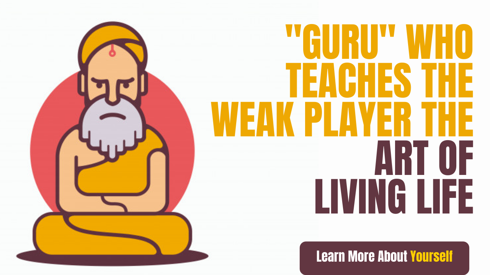

# &quot;Guru&quot;, who teaches the weak player the art of living life

A true Guru is not the one who does not let a person do his work by repeatedly pointing out his weakness and disability, but by making the same weakness shield him and make him a winning winner, let&#39;s read a story

&quot;Guru&quot;, who teaches a weak player the art of living, stood in front of the Guru with a hopeful look. The Guru was trying to test it with his connoisseur&#39;s eye. The boy, who was about nine-ten years old, was a child. He did not have a left hand, broke into a battle of oxen in the village.

&quot;What do I want?&quot; The Guru asked the child.

The child cleared his throat with a little cough and said, &quot;I want to learn wrestling from you.&quot;

Don&#39;t have an arm and fight wrestling? Strange thing, what went crazy?

## Why good?

&quot;The rest of the boys at school tease me and my younger sister. &quot;Tundra&quot; calls me Everyone&#39;s compassionate eyes have made my life hurt, hatred has come on me, Guruji. I have to live on my own courage and strength. Nobody needs compassion. I must come to protect myself and my family as well. &quot;

&quot;Good thing but now I&#39;m old and don&#39;t teach anyone, who sent you to me?&quot;

&quot;I went to many teachers. Nobody is willing to teach me. An elder teacher suggested your name. You can teach them only because they only have time and no one will be able to teach you, so say that. &quot;

Who would have given that arrogant answer, Guruji understood? It was because of people with such gurus that people of Khal tendency came into the game, the Guru knew this thing very well.

&quot;All right. To reach the arena before sunrise tomorrow morning and remember yes it is not easy to learn from me, these are the first ones to say. Wrestling is a deadly sport. Use it only for your protection. Having full faith in what I teach and the intoxication of this game also rises to the man. Therefore, keep the head and brain cool too. Understood? &quot;

&quot;Yes, Master.&quot; Understood. I will follow your everything faithfully. Make me your disciple. &quot;When the wish of the mind is fulfilled, the tears will spill into the eyes of the child.&quot; He happily touched the Guru&#39;s feet and took his blessing.

&quot;Guruji started learning only one child. He prepared the ground, hit his hands in the mud, blew the dust from Mugdul, and Guruji&#39;s eye caught on thinking right here to learn how to teach this one-handed child.

Guruji taught him the same bet and kept his child practicing every day. For six months, just one bet every day, the child does not understand, after all, why Guruji is doing this, he did not dare to ask, but one day the child touched his head with glee while pressing his feet on Guruji&#39;s birthday.

&quot;Guruji, it&#39;s been six months, I have understood the specifics of this bet and teach some new bets as well.&quot;

## Guruji got up from there and left. The child was upset that he annoyed the guru.

Nevertheless, the child kept learning by relying on Guruji&#39;s words. Then he never asked if there was anything else to learn.

After some time a wrestling competition was held in the nearby village. Great prizes were placed for the winner. The well-chosen wrestlers from each arena came to participate in the competition. Master called the child. &quot;Yesterday morning keep the bullock in the car. You have to go to a nearby village tomorrow morning you have to fight wrestling. &quot;

Wrestling began, with the first two wrestling victories in handless hands. If the horse which is expected to come last and wins the race, then the color descends, all the opposing masters have lost their faces. The viewing people were surprised. How can a child without an arm win in wrestling? Who taught it? &quot;

But now the front player in the third wrestling was not a novice. Older Jambaz player. But with his clean handcuffs and breaking the right bet, this wrestling also won the child.

This also increased the confidence of the child. The entire Mandan was also with him now. I too can win this feeling was making him strong from inside.

## He reached the final game of the game immediately.

The egotist who jokingly sent the child to this old teacher, the egoistic wrestler&#39;s disciple, was the last competitor of this child in wrestling.

Despite being of such age as a wrestler, he seemed superior to this child with strength and experience. He killed many people. It was obvious that he would tease this child in minutes. Pinchas consulted.

&quot;It would not be right to wrestle. After all, wrestling takes place in equal people. These wrestling matches are canceled according to humanity and equality. The prize will be divided equally between the two. &quot;The Pinchas revealed their intentions to everyone.

&quot;I am much more experienced and stronger than this young boy, Tunde. You all know that I will also win this wrestling. Then let me be the winner of this wrestling. &quot; He spoke in a competitive ego.

&quot;I am new and smaller in experience than the elder brother (competitor). My Guru has also taught me to play honestly. It would be an insult to my Guru to win without playing. Give me what I deserve by playing me. I don&#39;t want this begging for me. &quot; On hearing the self-respecting talk of that beau jawan, people showered with applause.

Such things sound good but are very damaging. Panch was discouraged by these talks and public opinion. At least a little too much? Already lost an arm, do not lose anything else? Stupid, everyone thought in his mind.

## The battle finally began.

And all the attendees were taken aback. The wager thrown by the boy in search of cleanliness and opportunity did not even make him stand up to that rude competitor. He was lying face down outside of the fireplace. At least that hard-nosed participant in the labor diluted even that old maharishi.

Upon reaching the field (the arena), the child took out his medal and placed it at Guruji&#39;s feet. Put his head on the forehead of the Guru&#39;s feet and bowed to Guruji.

&quot;Master, I want to ask one thing.&quot;

&quot;Ask what, what do you want to ask?&quot;

&quot;I had only one bet, yet how did I win?&quot;

&quot;You had learned two bets, baby, so you won&quot;

&quot;Which two bets Guruji?&quot;

First thing, you had learned this bet so well and there was no scope to make a mistake in it. Even when you fought in your sleep, you do not make a mistake in this bet. You know these bets, your opponent knew it well, but you only know this bet, did he know a little bit about it? &quot;

## &quot;Well, what else was it, Master?&quot;

&quot;Others matter more. Every bet has a redemption, there is no claim that does not break. Similarly, there was a break of this bet as well. &quot;

&quot;So won&#39;t my competitor know that, like that?&quot;

&quot;He knew that. But he could not do anything. Do you know why? Because in that break you have to hold the left hand of the bettor, which you do not have. &quot;

Now you must have understood how an ordinary boy without hands became a winner?

The thing that we consider to be our weakness, the one who teaches us to live by making us our strength and making us victorious, in the true sense is the &quot;true Guru&quot;.

Not everyone is proficient in every claim of life, everyone is weak, they are differently-abled. We need only the teacher who teaches the art of living by defeating that weakness (Weakness).