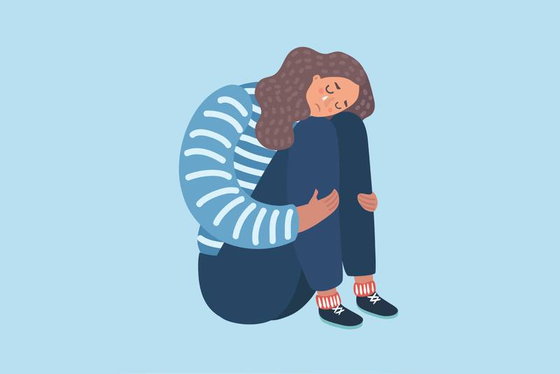

# How Loss And Grief Affect Normal Life?

If you are attached to someone or someone you love is taken away from you, it is not a pleasant experience so you feel very sad. It stimulates emotional distress, whether people can express it or not. Losing someone or something you love can lead to a range of emotional and physical symptoms that can lead to various changes in your body. One can experience many different emotions such as disbelief, guilt, anger, bitterness, and sadness. An individual's mental response to an event or loss cannot be predicted. Some enter into a state of trauma when dealing with loss and suffering while others work with resilience and finally make their normal life more difficult.

So in addition to the psychological effects, there are also physical effects of grief and emotional distress due to significant loss of life. Facing [loss and grief](https://www.helpguide.org/articles/grief/coping-with-grief-and-loss.htm) can have a serious impact on a person's health and well-being if they have a hard time in normal life. While people resort to many remedies during grief, some are healthy, while others may just be hostile depending on different people.

Some people are more affected by such events, while some are less affected. The occurrence of loss and grief can disrupt a person's regular life and affect his or her health and well-being. Some people are unable to sleep, eat or think properly, while some people resort to complete silence during such events to help them move forward.

## There are many reasons why a person may face grief for loss.

From the death of a loved one to a relationship, many things are associated with feelings of loss. Before looking at the tools to deal with loss and grief, We should look at the most common causes of severe grief. Which are as follows

1. Loss of a friend.
2. Death of loved ones
3. Divorced or broken
4. Graduate from school or college
5. Losing a job or career opportunity
6. Moving away from home
7. The death of a pet
8. Any traumatic event that leads to the safety or loss of a loved one.

So with these reasons, there can be many other reasons why the person is pathetic. It is not about the severity of the damage that determines the severity of the pain. Significant damage and microscopic damage can lead to a variety of pains in a person, which can lead to depression. After a long time of grief is that it eventually goes away. With time, resilience, and healthy remedies, a person may be able to accept his loss, and once acceptance comes, it becomes easier to face the loss and grief, etc. from which he can return to his normal life.

## 5 stages of loss and grief

**Acceptance:** With this part, the healing process speeds up and people begin to recover quickly from their grief and loss which is a good thing.

**Bargaining:** In this part, people often deal with the situation and try to negotiate the outcome in exchange for something. This depends on different people.

**Anger:** The stage at which a person gets angry at what happened and often blames someone for what happened, which is a very bad thing.

**Disclaimer:** This is the part where the person has not admitted or has not acknowledged the loss.

**Depression:** [Depression](what-about-study-stress) is a mood disorder that causes a persistent feeling of sadness and loss of interest this one is the most difficult and often effective phase wherein this phase of grief affects a person's physical and mental health are not stable. He starts to lose his appetite, he loses enthusiasm, energy, desire to work and some even commit suicide, while others isolate themselves. It is a crime to do this even if no one wants to do it.
