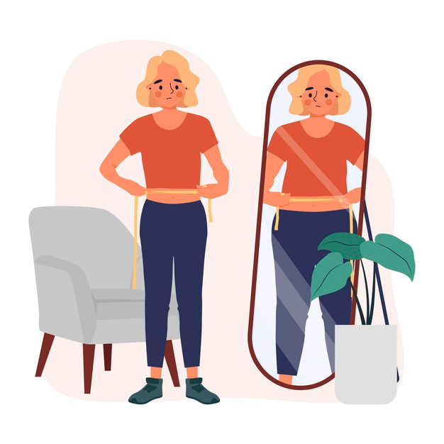

# How To Boost Self-Esteem With Positive Ways

## Why Boost Self-Esteem?

There comes a time in nearly everyone’s life wherever they're going through a phase of low [self-esteem](best-practical-self-improvement-tips). you begin to doubt your abilities and take a look at them to be influenced by what others think or say about you. the following are the issues arising from low self-esteem:

1. It is showing the feeling of "nothing is good".

2. Frequent episodes of indifference and restlessness.

3. Strive to say no.

4. Pay attention to your weaknesses.

5. Being very sensitive to other people’s opinions.

6. Being tough to have relationships.

7. Getting easily angry, frustrated or irritated.

8. Starting to hate yourself.

The long-term consequence of low self-esteem will be self-destructive if it's not removed at the proper time. But, regular use of positive techniques will solve this problem and help improve your self-esteem.

## Best Positive Ways to Boost your Self-Esteem

- 1. Practice positive self-talk and affirmations: making your inner self understand its power, is that the best way to build your self-esteem. as an example, trying affirmations like, “I am a powerful Soul”, “I am Capable and Worthy” and lots of such positive statements are useful just in case of self-doubt or anxiety and depression.
- 2. Surround yourself with people who matter to you the most: it's important, to surround yourself with people, who attempt to bring out the best in you. they'll always try and encourage you and encourage you to try and do the great thing, therefore helping you to boost your self-esteem.
- 3. Take out time to count your accomplishments: it's necessary to end your day, by concentrating on and celebrating the accomplishments that you just have achieved within the entire day. This way, you begin to focus a lot of on your strengths instead of the weakness and this helps to boost your self-esteem.
- 4. Help others to learn something new: it's said that knowledge is worth sharing with others. help others to learn one thing that they're not aware of. this fashion this way helping them to grow and at a similar time, you're proving to yourself however unique and an incredible person you're.
- 5. Always Follow your passions: Your [passion](https://www.thebalancecareers.com/what-are-you-passionate-about-2061274) or hobbies make you feel good about yourself and your fears and worries go away. It also plays an important role in your overall personal growth and boosts healthy self-esteem which will make you feel better and make you want to work harder.
