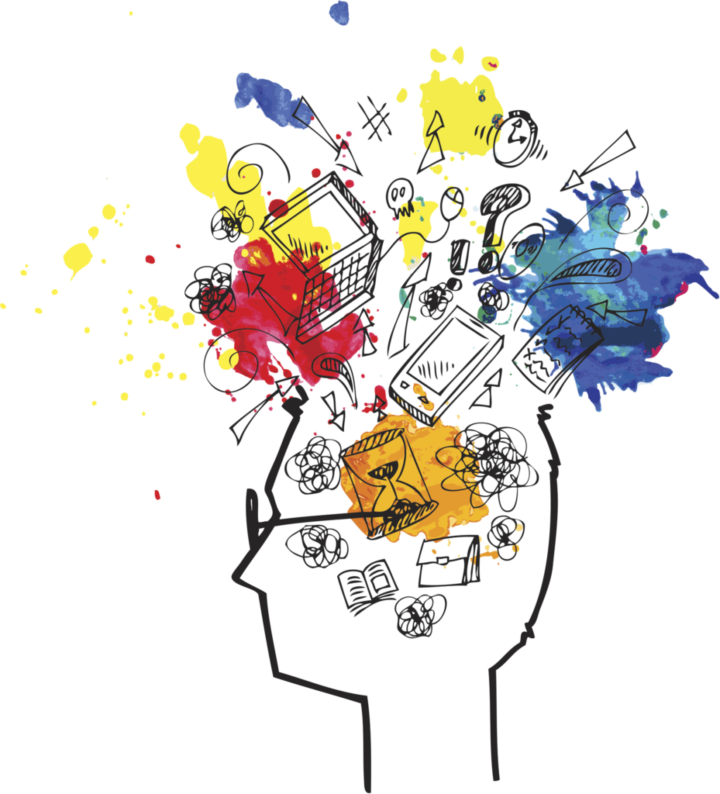

# How To Live A Quality Of Life 2021

A burning question that you often ask yourself is when your friend will ask you this question after a long time, we raise this question while keeping it for our near and dear ones and that question is ‘do you live a quality life’. The definition of [quality of life](https://www.motivationnyou.com/2019/12/how-to-live-a-life-of-quality/) is not common. Different people say different things about the quality of life. For some, wearing colorful and fashionable clothes and accessories and looking great, for others, quality of life means eating well and living a healthy life.

A quality life might be to go to a discotheque and visit twice a week for another. For some people, the lifestyle is living in a great place or traveling to great places. All these factors for quality of life are appropriate in their places. But, the factor we are going to discuss in this blog is related to our mind and psychology somewhere. Therefore, we put this factor at the top of all for a quality life, as the mind is the initial door to all of the above factors. Before moving on, let’s go through the fantasy scenario below.

## Imagination

You’re a fun guy, you like going to pubs, you like going to mills, you like going to discos and bars and all the fun. Imagine, one day you are at your home alone and you were told by your father that one of your relatives, who is a patient, comes to your house for a day and you have to take care of that patient for that day. You can't go out, you have to stay with the patient and take care of him. You have to follow what he asks you to do, whether it's food, water, or something else.

Now, you are going to stay with the patient because it is an order for you but somewhere inside, you are not happy at all. You want to escape from this situation anyway. The reason is that you are not ready to accept what comes into your lifestyle, you are not going to accept what you do not like. If you have this condition with you, then you are not living a quality life.

## Quality of life

When you don't feel good in any adverse situation, it means that you are losing your quality of life. I am saying this because it is not possible for us to live our lives with only pleasures or with the things we want in life. If it were true, many politicians, actors, and other celebrities of this world would not have gone to jail. They had power, money, and everything, but in spite of all that, they could not ignore the laws of the universe. They had to obey this law. The law of the universe will continue to present our funny moments and painful moments from time to time. Now, it is up to us to accept these two without any doubt in our minds. This is going to happen with more and more practice and when you can do this you will experience a quality life.

## Scope of acceptance

The scope of this method applies to everyone of any age. If you are a parent of a 5 or 6-year-old child, you should raise your child in such a way that he will not hesitate to accept any situation of his life, any different situation. Once you can do this for your child or his foundation becomes so strong he will prove himself as a warrior in real life.

Similarly, even if you are in your adult or professional age, there, you will face many situations where you have difficulty accepting things. Once you start adapting to different situations by following the above method, then you feel that confusion that had been in your mind for the whole time is gone. Now, you are free from the unwanted barriers of your mind because your mind is clear, now your mind matches the mind of the world. So, everything has become very easy for you and when everything is easy for you, it is called a quality life.

The same is true in old age, if you practice the above method in your adulthood or old age, you will have no trouble even in old age because you were in its practice. In case, you have not studied it before then you can start applying this method. Quality of life is not related to any age limit, as it is never too late to learn.

## Concluding part

Concluding I just want to add that we are not just advocating quality in this way and will not go for things that create a little joy and entertainment in your life. You should definitely go for it all if you are aware of its limitations and modes. Be [creative](3-exercises-that-will-help-you-visualization-a-better-work-life) and confident with your thoughts and beliefs. Live the lifestyle of the moments or situations that come in your life, no matter what type it is. To complete the qualification process, once you get it in your life, you will be able to share it with others.
