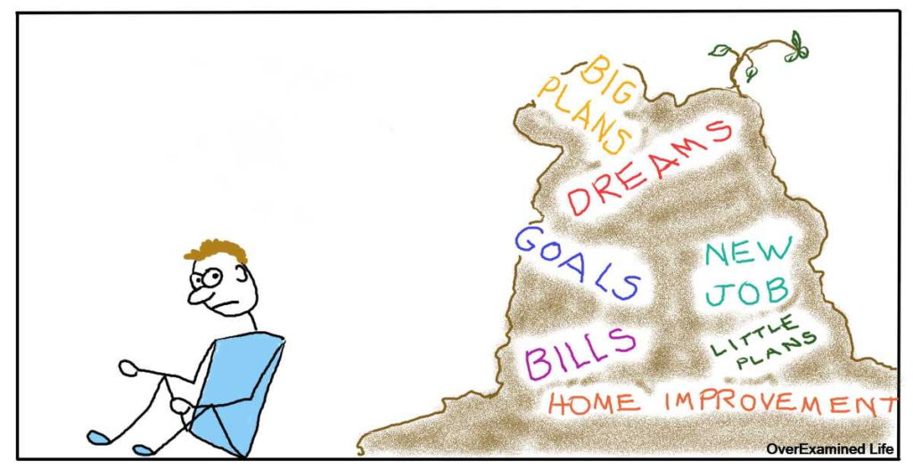

# How to remove procrastination from your life

Hi and welcome back to learn more about you! So today we do not know how to remove the [procrastination](https://productivityist.com/getting-rid-procrastination/) from your life and this article will help you in this

Apply various techniques from this guide, and you'll be pro-productivity! So, follow these tips to start your search after productivity rather than procrastination!

First, ask yourself why you are avoiding a task

Often we are afraid that the results will be good, avoiding the resulting tasks. If a project can go on even if you are not considered, ask yourself which could be the worst problem.

Chances are even if you break, it will be a decent experience. And if you succeed in something like a part project, that's even better! Putting things into perspective will help you get out of the procrastination pattern-state.

## Always improve your environment

Do you have any major disturbances?

We all deal with them, however, it is best to minimize them. For example, trying to complete one thing in a very cozy bedroom will not work. Instead of working, you go to sleep! And, the dog around you is not constantly useful. You will temporarily block them from your operating area.

To set [yourself](best-practical-self-improvement-tips) up for success, create a place for the workplace. Since it is the opposite of having a workspace in your bedroom, it is much easier to focus on it.

## First, make an issue directly from your list

Now the list is growing day by day. We hate to interrupt it for you - however, it is not intended to be short.

Rather than proceeding to rationalize, investigate your rundown. Make an issue right now! Take your out or use your T-shirt inside the dresser. You don't have to spend a lot of your time, and getting an issue is no better than anyone!

If you are doing a task directly, it is less likely to be completed. But, once you finish a task, come to the current article to get a lot of tips! You are on the roll to become more productive. A long time ago you were checking your list from left and right!

## Give yourself timelines

Jobs that don't have deadlines. They are difficult to achieve as a result of them constantly being last on your priority list.

So, to make sure you remove them from your list, give yourself a time issue. If you don't complete the task as a result of strange expectations (or unforeseen circumstances!), You always change to a later date.

But, at present, you will have at least one point. Your mind understands time as an essential tool, which makes it very important to follow. And once you complete the content, it will bring you one step closer to completing different jobs!
