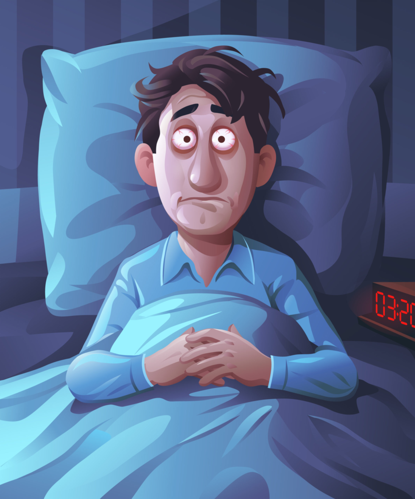

# How To Sleep Well Better

Sleep is the greatest gift of life and it does wonders for our mental and physical health. However, sleep hygiene deprivation can be complicated, as insufficient sleep is a public epidemic, according to the Centers for Disease Control and Prevention (CDC).

Sleep takes up a third of our lives and it has a tremendous impact on how we live, act, and function during the other two-thirds of our lives. Indeed sleep is really as important as the air we breathe and what we eat.

In the United States, 70% of the old report getting insufficient sleep at least one night a month, and 11% report getting insufficient sleep every day.

It is calculable that sleep-related issues have an effect on fifty to seventy million Americans of all ages and socioeconomic categories. Then whether it is too much sleep, too little sleep, the awakening at night that results in disturbed sleep, we as a nation can improve our sleep hygiene.

As we accept the cold winter months and continue to go through the Covid-19 epidemic, it is even more crucial, now that we practice healthy sleep to protect our mental and physical health.

## What is good sleep hygiene?

Understanding sleep hygiene and setting a good routine for yourself will help you [sleep better](https://www.verywellmind.com/how-to-get-better-sleep-5094084) and more refreshing.

### Be consistent

Go to bed and wake up at the same time every day, even on weekends and make sure you are getting seven to nine hours of sleep every night. Inconsistent sleep schedules or poor sleep can result in:

- Cardiovascular disease
- Diabetes
- Obesity
- Unnecessary stress levels
- Frustration
- Addiction
- Anxiety

### Make sure your bedroom is comfortable

Your bedroom should be your sanctuary. Sleep in cold temperatures (about 65 degrees Fahrenheit), block light from heavy curtains or eyeshadows, and drown out the noise with a white noise machine or earplug.

You should ensure that your bedroom is de-cluttered and clean. You can also try scented candles or scented scents like lavender or chamomile.

Also, be sure to use only your bedroom for sleeping. Do not use your bed as an office or bed to watch television.

### How To Invest In Your Bed And Bedding

Your sleep surface is important for your mental and physical health. Poorly designed or old mattress and pillow can lead to disturbed sleep, back pain, and sore throat.

**Choose a supportive bed and pillow:** Make sure you are sleeping on a bed and pillow that has enough support and comfort for your body.
**Look for quality beds:** Since we spend about one-third of our lives sleeping, quality beds can be a good investment for you.

### Avoid Blue Light Before Bed

The use of artificial lighting and electronics at night will contribute to sleep problems. Electronic devices such as computers, smartphones, tablets, and televisions emit blue wavelength light, which can fill your brain with daytime thinking. This, in turn, will disrupt your biological time.

Many studies suggest that blue light in the evening disrupts your brain's natural sleep-waking cycle, which is critical to optimal health.

Getting blue light during the day, particularly from the sun, will assist you to keep alert whereas reducing fatigue and up your mood and performance.

**Tip:** The rule of thumb is to avoid all electronics thirty minutes to an hour before bed.

### Wake up when you can't sleep

On some nights, it is difficult to fall asleep or fall asleep. You can toss and turn, look at the clock, count the sheep, and get frustrated.

If you try to fall asleep but are seen snoring and turning for 20 minutes or more, get out of bed and relax, such as reading a book, journal, listening to music, or meditating, then try and Go to sleep

### Install a quiet sleep routine

Whether it’s taking a warm bath before bed, meditating, or reading, create a wind-down routine that relaxes your body and mind before you go to bed.

The goal is to keep going to bed when you are relaxed and tired, not [stressed](what-about-study-stress) and wide awake.

## How daily life affects your sleep

Our day-to-day routine is just as important as our pre-bed night time routine. We must take care of our mental and physical health during the day so that we can get sleep at night. The following are necessary steps to require during the day:

- Exit
- Staying physically active
- Avoid nicotine
- Reduce alcohol and caffeine intake in the evening
- Avoid eating late at night

The basic concept of sleep hygiene, that your environment and sleeping habits can be optimized for better sleep, applies not only to everyone, but the idea of sleep that appears can vary from person to person.

In other words, your sleep routine may not work for your friend but it does not mean that your sleep routine is right or wrong, it simply means that it works for you.

In addition, you may need to try different routines and methods to find the ones that help you sleep the most, but it is also important to know that improving sleep will not solve the underlying sleep problems or mental health disorders.
