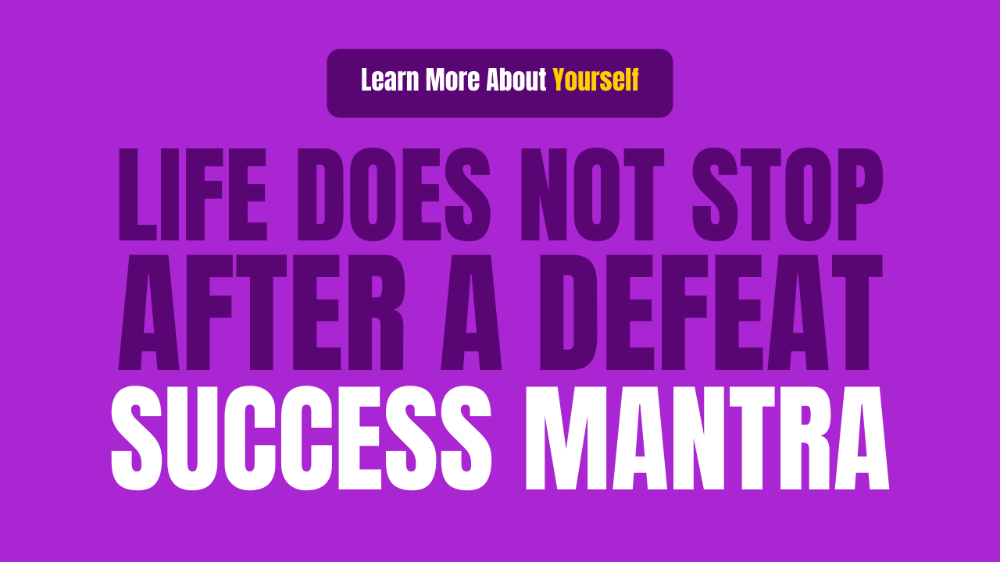

# Life does not stop after a defeat - Success Mantra

**&quot;Whatever happens in this life is for good&quot;**

This line has led a lot of people to think Positive. How many people have understood the meaning of this line and made revolutionary changes in life?

When we were young or going to college, when there was a slight failure, everyone would repeat the same line and explain to us and say

&quot;What happens is for the good&quot;

And we used to go forward thinking here in our life, yet there are many people who do not understand this thing and stop after getting a defeat and do not even think to move forward.

## Today&#39;s post is on this topic

&quot;Life does not stop after a one-time failure, even after that there remains hope.&quot;

**Even after a defeat, there are many opportunities in life.**

**- Mary Kom**

So, let&#39;s talk about this topic in detail.

Let&#39;s first hear a story. This is the story of a man who was born in a poor family, like his parents, who used to run a family.

This man was not as brilliant in reading since childhood.

He also failed several times during his primary education.

He could not pass the exam many times even during his degree.

He also applied 10 times at Harvard University and got rejected 10 out of 10 times. This person once applied for a job in a company. Total 24 people applied with them, 23 of them got selected and single was the only one who got rejected.

What do you think he would have stopped? He would have given up.

Did not give up. After some time, he applied for the form for the police. This time 5 people had applied more, out of that 4 people got selected, this time also the same was rejected.

After getting such rejection, a normal person accepts defeat, breaks down. But this band did not give up.

To meet its daily needs, it may have accepted to work as an English teacher, where he used to get a $ 12 per month salary.

Even after this, the worm of doing something big inside it was not dead.

He kept growing bigger inside.

## Do you know who this person is?

Founder Jack Ma of Alibaba, a multibillionaire company.

Jack Ma continued to work with the vision of starting an internet company for his country.

Despite facing so many failures and difficulties, Jack Ma transformed his dream into reality. Today we are all reading him a story.

Difficulties and problems in life are easy to come by.

No matter what field you are in, you will get defeated, you will have to face troubles, but you do not have to give up.

**Jack Ma says - &quot;Giving up is the greatest failure in life&quot;**

As long as you work, you work by giving your best, if you set a goal, did not achieve it, then do not panic, do not give up, then give yourself a chance to do better than before. Once again, prepare yourself to take it to the next level.

Many big leaders of the world have also failed many times in their lives, stuck, faced defeat, but did not give up.

Make your failure your mentor, ask for your guidance from it, learn lessons from your failures, then start again and make the experience gained from your failure a ladder to success.

Rectify your mistakes and remove your flaws.

See how results change and goals are achieved.

What is the quality of a great leader?

They learn from their move on and mistakes.

It&#39;s the true secret to success

The ability to learn from mistakes and persevere, do not give up!

Now, here we know the skills that make a leader successful. There are three very important and special skills that make a leader successful.

A common man who wants to succeed in his life, if he too develops these three skills within himself, then, of course, his way of thinking will change, the mindset will change and he will have a spirit build of never give up, which is very important Huh.

It&#39;s three skills

1. Vision

2. Tenacity

3. Grit

Let&#39;s talk about these three

## 1.Vision

If any person wants to see himself standing in the queue of a successful people, first of all, he should be Visionary. Whenever new opportunities come in life, visualizing the benefits of its future should start working for it.

And the difficulties that come with it should also be visualized and thought about its solution.

The biggest feature of being a visionary is to recognize his solution even before problems arise.

Being a visionary can make you a Billionaire, this is the first step to being successful, you can see Visionary Entrepreneur Elon Musk. Those who had visualized that 20 years from now, there is a future in the field of electric cars, solar energy, and space in the coming times and they even put all their earnings into this vision.

Until 20 years ago, his name did not appear in the list of top 10 billionaires,

Look there today

In this Corona era, when jobs were going out, companies were going bankrupt, GDP was falling, Elon Musk&#39;s wealth kept increasing manifold, today he is the 4th Richest Person after Jeff Bezos, Bill Gates, Mark Zuckerberg.

That is why having a visionary can make you rich, do not stop in life, and keep moving forward.

## 2. Tenacity

Let&#39;s define tenacity a little, according to yourdictionary.com

The definition of rigidity is the state of holding fast to an idea or thing.

That is, your Idea, hold this Idea firmly, stick to it, trust your vision.

Many people make the mistake that some idea came to them, worked on it for some time if nothing happens when they leave it and start doing other work.

Only then do we feel the need for tenacity, tenacity is the skill that supports the vision.

Or we can say

Tenacity is the foundation of vision.

If you want to be successful, then don&#39;t give up, develop tenacity inside yourself.

## 3. Grit

Grit is the ability to do what is needed to get the job done.

George ilian, the author of &quot;Top visionaries who changed the world&quot;, says that a Great Leader must have Grit, Grit (patience) is the skill that provides strong willpower to do the most difficult tasks.

In the journey of a common man, he hears the voice of his mind, and the mind always tells him to avoid difficult tasks, he wants to remain in the comfort-zone and this will weaken the willpower.

But sometimes this happens, we also have the vision, tenacity too, but if Grit is not there, then we cannot do any work successfully and fail.

Do not work when you want, work because you have to work, work, work.

And the only Grit skill that will come in will be successful in every field.

If you have lost in your life and you are thinking of giving up, then apply these three skills in your life and see how your life turns.

And keep this in mind always, life does not stop after a defeat.