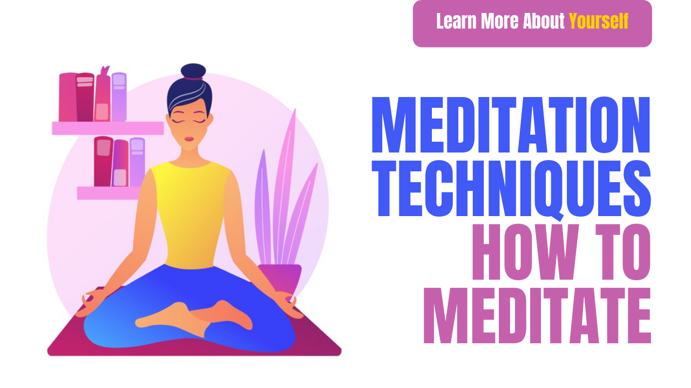

# Meditation Techniques | How to meditate

Friends, we are constantly getting messages about what meditation is, how to meditate, how to meditate, what are the benefits of meditating (Benefits of Meditation) Our mind does not concentrate on one thing, how to concentrate. What are the best Easy Meditation Techniques? For the response to all these questions, we are sharing with you Meditation Techniques. How to meditate

## How to meditate

Today&#39;s Our Post Meditation Techniques | How to meditate, you have to give information about meditation, this post has been written keeping in mind every age group. Students who feel that they do not feel like studying will help them to read through this Mediation Technique, Concentration Will increase. Tanagers who feel they are unable to decide what to do in life or are unable to make a decision will also get help in decision making from the Meditation Technique, and the age group who have peace in life, self-realization, self-awareness, Live in the Present Moment Wanting them too, Meditation Techniques this post will help in achieving all these aims. Friends, to get all these results, you will have to do 20 minutes of meditation daily for at least 2 months. After that, you will start seeing results. If you want, you can start Meditation 10 minutes in the beginning. A person should do Meditation equal to his age in one day. If you are 20 years old then you should do 20 minutes of Meditation in 1 day.

## Meditation technique

In this post Meditation Techniques, we will cover

- What is Meditation?
- How to Meditate How to Meditate?
- Benefits of Meditation Benefits Of Meditation

## What is Meditation?

Meditation Meditation is to awaken your sleeping powers. Make full use of your mind. According to science, we use only 2% of the volume of our brain.

In simple words, suppose we have some raisins in our hands, we have scattered those donations on the ground. Now we have to cover those donations, similarly, we have scattered our minds in many places Meditation is the medium through which we Many places that have left the Scatter the mind, remove it from those places and place it where we want to place it. That place can be anything, for some people that place is God, for some it is for business, for some it is, etc.

According to spiritual guru Osho - Meditation Meditation is the process of cleansing oneself, an attempt to be refreshed and young, an attempt to live life to the fullest. If you are afraid of meditation, it means you are afraid of life, you are afraid of frustration, and if you do not resist at all, it is probably because you do not take meditation seriously, you do not meditate. Don&#39;t take it honestly. &quot;

## How to meditate

Initially start Meditation from 10 minutes.

Some Easy Ways to Meditation

Sit comfortably in a quiet place, play a little soft music and count your breaths. Initially do this for 10 minutes and gradually increase the time to 20 minutes.

You make a point on the wall of your house and watch it continuously for ten minutes. This is also a good way to meditate

It is very important to calm your mind in the beginning to meditate. The mind is not possible when anger, jealousy

Whatever work you are doing, do it with full concentration. Keep watching while your mind did not think of anything else.

Relax tension in every part of your body by sitting in happiness easily. And feel that all the stress is coming out of your mind and body with the breath. And if you have pain in any part of the body or there is some disease, then imagine that your pain is coming out of the body through the legs. By completing the drawing, your body will slowly begin to recover.

By the way, you can do Meditation anytime. But the time till 7-8 is is considered to be the best time for meditation.

## Meditation Techniques For Beginners

Sit comfortably and count to 1-100. And do this action 2-3 times a day. Doing this will keep the mind focused.

## Meditation Benefits of Meditation

Connected With God

With Meditation, we calm our own minds.

It is said that the human mind is a storehouse of immense powers. And you can increase your sleep power.

According to the great Spiritual Guru Osho, if you want to live your life to the fullest, then meditate.

You live a stress-free life by meditation

You can do your work on time

You can easily keep the names of people in need of your daily life.

The body is more healthy

Sleep well

Students are able to study well in a short time.

Carefully both your confidence and concentration increase.