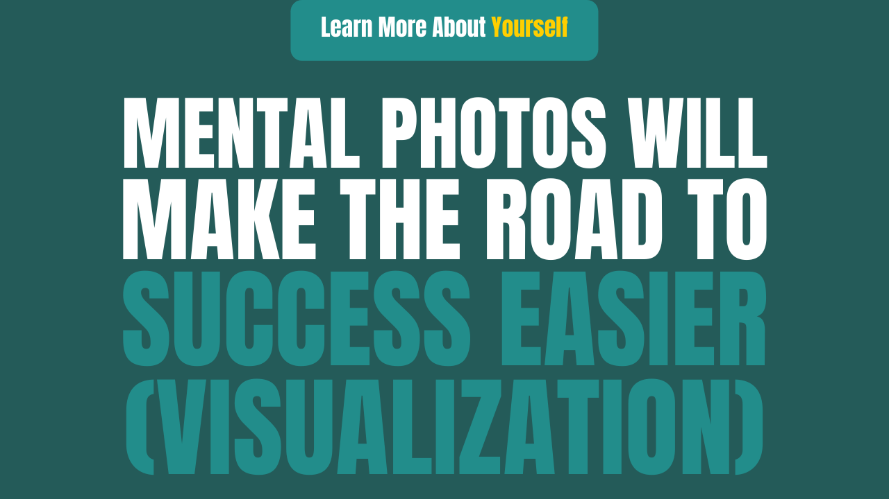

# Mental photos will make the road to success easier (Visualization)

In 2006, the author of the world&#39;s best-selling book, The Secrets, is &#39;Rhonda Byrne&#39;. It is a self-help and motivational book. This book has sold more than three crore copies in fifty languages ​​all over the world. This book is based on the law of attraction, according to this rule, any person can get what he wants only through his thoughts.

One important stage of this book is to make mental images.

Viewing a mental picture is the process of making pictures in your brain. In the process, you enjoy the things you want. When you visualize, you generate strong thoughts and feelings about being near that thing. Then the Law of Attraction sends the truth into your life by doing the same thing as you saw it in your brain.

Every person has the power to see the mental picture. Come, let me prove this in front of you by making a mental picture of a kitchen. To do this work, first of all, you have to get all the thoughts of your kitchen out of your mind. Do not think about your kitchen at all. Remove the pictures of your kitchen, its cabin, refrigerator, oven, tiles, and paint from your brain completely… You saw the picture of your kitchen in the brain, right? You have just seen the mental picture!

**&quot;Every person sees a mental picture, whether he knows it or not. Seeing the visualization is the great secret of success. &quot;**

Here is a tip about seeing mental pictures, which Dr. John DeMartini gives at his seminars. John says that if you create a static picture in your mind, it can be difficult to maintain it, so make an active picture and fill it with lots of activities. For example, imagine your kitchen again and this time imagine that you are entering the kitchen, going to the fridge, putting your hand on the door handle, opening the door, looking in, and Looking for a bottle of cold water. Put your hand inside and pick up the bottle. You can feel the coolness in your hand while holding the bottle. You have a bottle of water in one hand and with the other hand, you close the door of the fridge. Now that you have taken a mental picture of your kitchen with detail and mobility, it is easier to see and maintain it, isn&#39;t it? We have so much power and potential that we don&#39;t care.

**Seeing the mental picture is one of these greatest powers. &quot; - Genevieve Behrend**

Decide what you want Believe you can find it. Believe that you are entitled to it and believe that it is possible for you. And then every day close your eyes for a few minutes and see the mental picture that you have what you want. Feel the feelings of being near it. Then focus on that, for which you are already grateful and really enjoy it. Then start your day and dedicate it to the universe. And trust that the universe will find out how to manifest that thing in your life.

**Imagination is everything. It is a preview of the upcoming attractions of life. &quot; – Albert Einstein**

If you allow even a single idea of ​​the doubt to enter your brain, then the law of attraction will soon draw suspicions one after the other. The moment any idea of ​​doubt comes immediately throws it out. Send that idea out. Think of it instead, &quot;I know I&#39;m getting this thing. &quot;And feel it.
