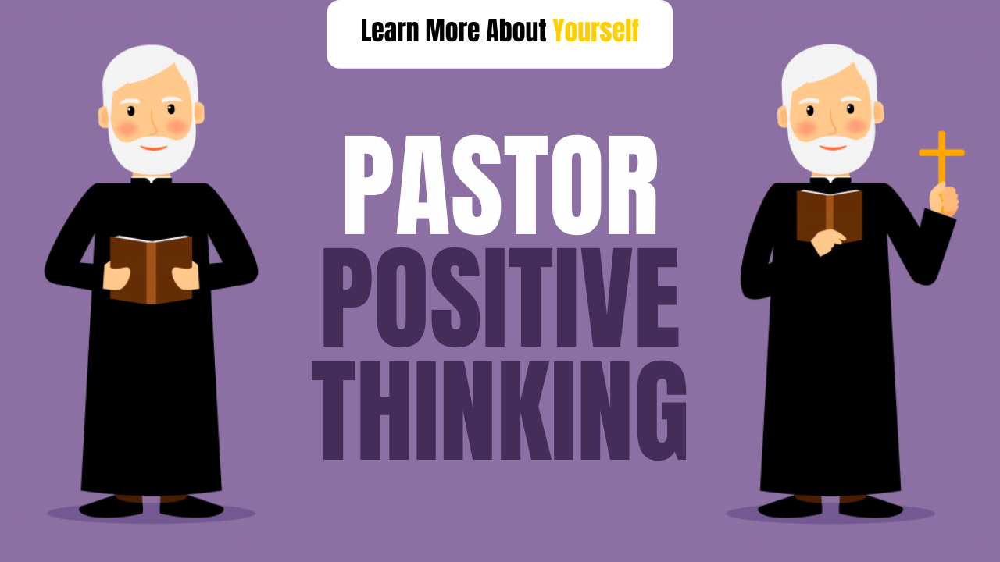

# Positive Thinking Stories | Pastor Positive Thinking

Friends, today we are sharing with you Positive Thinking Stories, Friends, this story will help you to make your thinking positive, inspiring stories always help to increase the enthusiasm of everyone, and leads to the goal.

## Power of Positive Thinking

Our life is in our hands, whatever we make it like (As you think, you achieve), you must have seen that some people see goodness in everything, no matter what the situation is and some people get annoyed in a little bit.

All successful people always keep positive thoughts in their memory.

We see our benefit in every work, they never do business in which there is a loss, then why should we keep such a thought that only our loss is there.

Let&#39;s read a story on positive thinking

## Positive Thinking Stories

One was a pastor. He was very positive and never thought wrong of anyone.

Once he was drinking coffee while sitting in the restaurant, then he saw a disciple there and he was eating meat.

The pastor said to the disciple - oh, you forgot today is the day of fast?

Disciple- No, I have not forgotten my head.

Pastor- You must have told the doctor to eat this.

Disciple- No, Sir doctor did not even say.

Pastor- Looks up at the sky, says something that makes that disciple realize their mistake

### Questions

1. What does the pastor say

2- What is the Moral of this story

Ans 1. Looking at the sky, he says, &quot;O God, how much we can learn from today&#39;s generation, do not lie to hide it if we make this mistake&quot;. If he wanted the word, he could have said yes Sir, the doctor has eaten me to eat meat. But it did not do that.

Ans 2. The moral of this story is that we will benefit from always seeing goodness in everything and event, we will do our own harm by negative thinking.