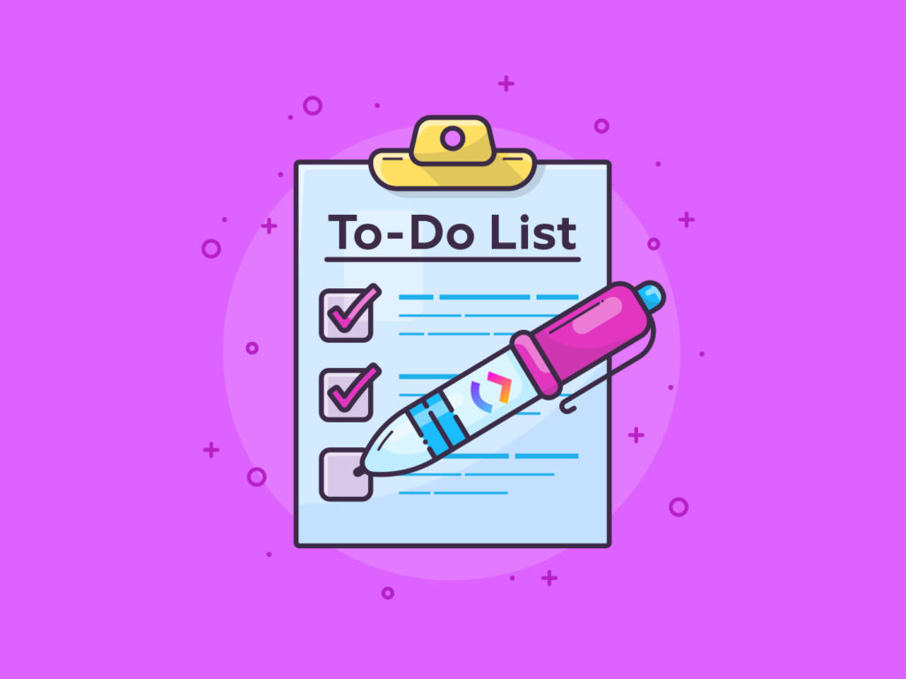

# Preparing A To-Do List

## The key to efficiency

Are you overwhelmed by the amount of work you have to-do list over and over again? Will you find yourself missing the deadline? Or do you sometimes forget to do something important, so that people chase you for work?

These are a number of the goal-setting shareware that you just can use. This is a list of priorities for all the tasks you need to proceed with. With the most important tasks at the top of the list and the least important tasks at the bottom, they list everything you need to do.

By keeping such an inventory, you make certain that your works are all written in one place so you do not forget something vital. And by prioritizing tasks, you organize them in the order in which you'll do them so you would like immediate attention and can tell what you'll leave until then.

A [to-do list](https://www.mindtools.com/pages/article/newHTE_05.htm) is essential if you are going to beat work overload. When you don't use it effectively, you will make the people around you look decent and unreliable.

When you use it effectively, you will be better organized and you will be more reliable. You will expertise less stress, safe within the data that you just haven't forgotten anything vital. In addition, if you prioritize wisely, you will focus your time and energy on high-value activities, which means you are more productive and more valuable to your producer.

Having a well-designed and thoughtful list seems easy enough. But it may be surprised how many people fail to use it, no matter how effectively it is used.

In fact, it is often when people start using it effectively and sensitively that they progress to their first personal productivity, and begin to build success in their careers. Below, the video offers some tips on how you can get start using To-Do lists more effectively.

## Preparing a to-do list

Get start by downloading our free template. Then follow these steps:

## Step 1:

Write down all the tasks you would like to finish. If it's a large task, break the first action step, and write this with the larger task. (Ideally, tasks or action steps should not take more than 1-2 hours to complete.)

## Step 2:

Perform these tasks within the priority allocation of A (important, or terribly urgent) to F (important, or not all urgent).

If too many tasks have high priority, run off the list again and demote less important tasks. Once you've got done this, rewrite the list so as of priority.

## Use your to-do list

To use your list, work your way in order with first priority tasks, then BS, then CS, and so forth. As you complete tasks, mark them or strike through them.

What you put on your list and how you use it depends on your situation. For instance, if you are in a sales-type role, an honest way to encourage yourself is to stay your list relatively short and aim to complete it a day.

But if you’re in an operational professional role, or if the tasks are large or based on too many people, then it would be [better to focus](how-to-building-self-confidence) on a long-term list, and “chip away” from day-to-day.

Many people find it helpful to spend 10 minutes at the end of the day, planning tasks on their list the next day.
