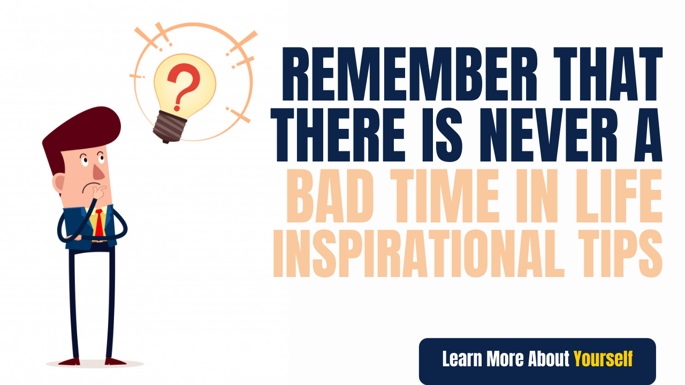

# Remember that there is never a bad time in life - Inspirational Tips

&quot;I was about to be shot, there was a criminal who wanted to escape by making me a pawn, a policeman pushed me in the circle to save me from the shot and I fell straight down the floor, that day I survived to die.&quot; Gone, but my legs paralyzed and from that day on, I walk in this wheelchair, that day was not a bad day for me.

Yes, it seems like you are thinking that it was the worst day of my life, before this accident, my dreams were different, my life goals and objectives were different, but in a moment all Something changed and I was sitting in the hospital crying, cursing my luck and calling the above good and bad, but suddenly a voice came from inside me.

Your legs are not working only, you know what is left, right now the breath is going on, the biggest thing is that I am still alive when I saw this positivity of life, my thinking attitude Changed and a ray of hope started to appear in life again, streaks of happiness pulled on my face.

Now life was giving me two options, either I become a Victim and cry all my life for bad luck and a bad day or I can become a Survivor and become an inspiration for Jiu and others, and the very moment I chose the second option, to be a Survivor and After being discharged from the hospital, I moved from Mumbai to Delhi and applied for a job in an ad company and got my job in the animation department and today I am in front of you.

At this time many colleges, university schools approach me and invite me for a session here, today I have fallen in love with this wheelchair, many people who are in bad condition come to meet me, seek advice. Is, and I get very good vibes in helping people. &quot;

## Remember that there is never a bad time in life - Inspirational Tips

In this speech of Mahira of the latest web series Breathe: Into the Shadows on Amazon Prime Video, we learned a lot about life, about perspective. It teaches us to laugh at life - live and play, whatever is happening in your life does have some meaning, maybe at that time we may not understand that but today or later we will understand everything. is.

Because whatever the person above does right with us, he does it only to do something good.

Famous writer William Shakespeare also says

**&quot;There is nothing either good or bad, but thinking makes it so&quot;**

That is, &quot;Nothing good or bad happens in life, but our thinking only makes it good or bad&quot;

What a mean thing it is…

What is our life after? It is just made of material, our thoughts and attitudes give meaning to all these things.

Bad times in life never comes

And apart from this, everything that comes to our mind is our thinking/thinking/attitude which calls it good or bad, that is why only so many books have been written on Thinking and Mind.

The Power of Positive Thinking, The Power of your subconscious mind, Think Like a Monk.

And all Motivational Gurus also give importance to thinking.

Whether it is Tony Robbins, author of Unlimited Power, or Mel Robbins, author of The 5-second rule, there are many names that tell us how we can overcome every problem of life by changing the way of thinking.

Let us now look at some other cinereous and know when we feel that our bad times have come?

The first scenario in this can be that when our job is lost and we become unemployed, no work is available, and the whole family is dependent on us, and due to no income, our Savings will start to die first. And when we apply to another company, we get a rejection from there also.

And we can say to this cinema that our life has started a bad time, or when any person comes in this phase, then he starts saying that a bad time has come in his life.

But can we also see the positive side of this cinerea?

**&quot;A problem is a chance for you to do your best.&quot;**

**- Duke Ellington**

This Quote says that don&#39;t look at the problem like a problem, you can see it as an opportunity, you can also see it as a chance to do your best.

The cinerio above tells us that you were already in the wrong company and nowadays it would have removed the company, it is good that it removed some earlier so that you get a chance to do something else. has gone.

From now on, when you go to another company, you will take full care that my job is not everything to me, you will not depend on only one income, after that you will try many things and new income for yourself. Source will be extracted, and maybe something very good came out beforehand, which if you were in a job, you would not have imagined to get all this.

What you call your bad time is your teacher who teaches you all these things in actual.

Instead of giving importance to Savings, invest money and invest the money in your share market, real estate.

Do not take jobs for four guarantees, jobs can go at any time, so always be prepared for it.

The most important thing is to stop cursing luck and God or time when bad times come, change your way of thinking and stop doing this which are proving yourself weak by saying bad times, bad times and other circumstances. Learn to take action to get through.

Learn to give priority to your family.

If you do all this and think in this way, you will find that what we were saying at a bad time is now working for us as a guide, a mentor, a mentor, a teacher.

So it is said that

&quot;Never a bad time in life&quot;