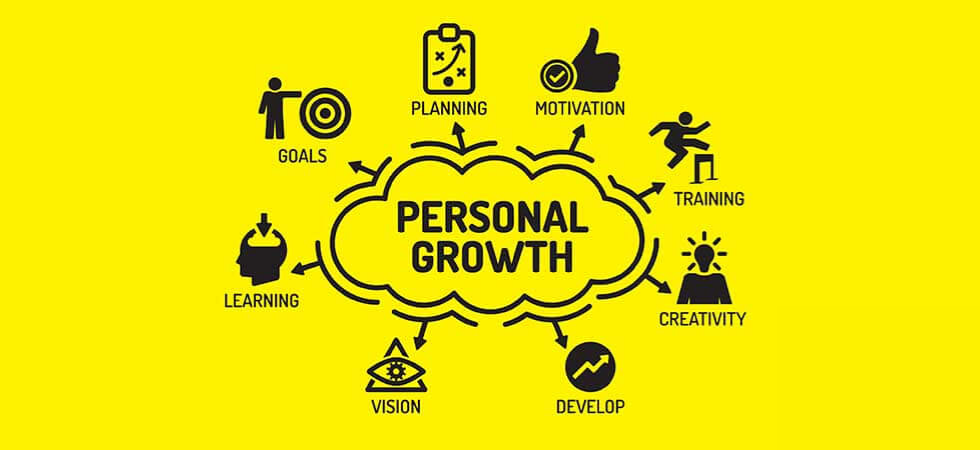

# Self Help and Self Improvement Strategies

Hi and welcome back to [learn more about yourself](https://learnmoreaboutyourself.com/)! Discovering your life objective through self-improvement and self-help can be significantly tougher than a lot of people believe it is.

## Simple Approaches for Discovering Your Life Purpose

Discovering your life objective through self-improvement and [self-help](https://en.wikipedia.org/wiki/Self-help) can be significantly tougher than a lot of people believe it is. More often than not, if you ask people just what their purpose is in their life they will provide you with a hazy list of goals or responsibilities for example: being a far better mother or father; being a good friend; being a decent individual… and of course these things are essential. However, who does not desire to be a better parent or guardian, a great buddy, and a decent person? If you wish to discover a definite purpose for your personal life. The one that fills you with enthusiasm and passion and provides you with an understanding that you are living for something larger than yourself. You should proceed past the realm of generalities.

It really is just like the inspirational speaker Zig Ziglar stated in his book “Over the Top”: “You can never be successful as a roaming generality, you have to become a meaty specific”. Thus if you're really ready to induce specific concerning your own mission right here on earth. Below are many simple techniques for locating your life purpose.

## The Starting point to locate Your Life Purpose Through Self Improvement

The first thing you have to do when it comes to discovering your life purpose is to forget about all of the noise and static that is trying to keep you from “hearing” the still small voice that is within your heart. Certainly, there are lots of useful things one can learn from external sources as well as other folks’ input. Nevertheless, with regards to your finding your life purpose. The most important person you must have a consultation with is always available, and that particular person will be you. The trouble is that many of us are swamp with all too many thoughts, opinions, and suggestions about precisely how things ought to be that we now have desensitized ourselves to that little voice of our heart.

Your own individual and spiritual development is your own responsibility and no one else’s. Irrespective of the number of people that will attempt to tell you what you ought or ought not to do with your life. Once you’ve filtered this stuff out by cultivating “selective ignorance”. You can begin being focused on the skill that will assist you in locating your life purpose.

## Self Help Begins With Listening To Yourself

The most crucial thing you, an individual can do to begin creating self-awareness and learn exactly what YOUR own unique objective is right here on earth would be to start listening to your self, and the easiest method to make this happen is as simple as maintaining a daily record of your thoughts. The truly amazing inventor Benjamin Franklin once stated: “If you are never to be forgotten when you are dead and decaying. Either perform things really worth writing about or write things price reading concerning”. This specific language should have already believed by a variety of alternative marvelous high achievers in history thanks to the actual fact a great deal of them had been prolific writers that kept tabs on their own ideas and thoughts in personal diaries and letters.

Writing can be a focused exercise for your mind plus it allows you to clarify. The random ideas that are moving around in your head making you nuts for the majority of the day. Start to craft these types of ideas and thoughts down and write down the responses to questions for instance. "Do I want to achieve something important before I die?" When you ask yourself these kinds of questions or "Is it one thing that people remember me?"

And lastly...

## Discovering Your Life Purpose By Pursuing It

The truly amazing author Jack London once stated: “You cannot wait for inspiration to come to you. You have to pursue it with a club”. This is also true with regards to discovering your own personal purpose. You need to begin feeding your mind with things as well as searching for materials. That will assist you to further comprehend your very own wants. If you wish to do something with your own life. You can guarantee that somebody else has possibly tried it themselves or otherwise something related.

Therefore commit yourself to turn into a keen reader and researcher of what interests you. And also together with your own journaling, you are going to ultimately be successful in discovering. Your own life purpose through self-improvement and self-help strategies.
