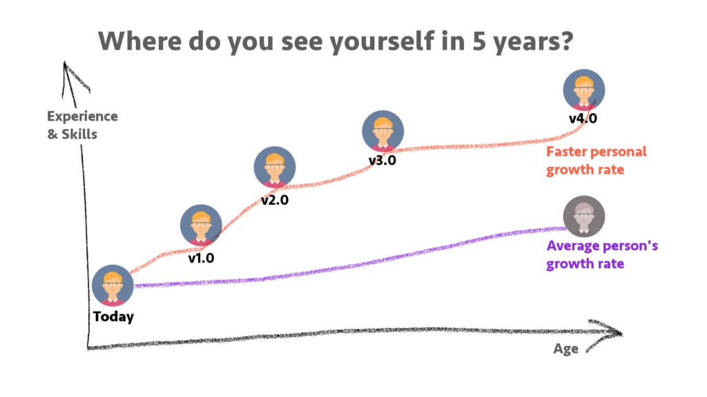

# Single Most Important Self-Improvement Tool?

Hi and welcome back to [learn more about yourself](https://learnmoreaboutyourself.com/)! So when you are seriously committed to personal development and improvement, you may not know what is the only most important [self-improvement tool](https://medium.com/swlh/self-management-tools-to-boost-your-personal-growth-quickly-a446eca22e1c) to use?

## Could it be meditation?

I consider meditation to be absolute when it comes to self-improvement, but whether you need it alone, I don’t know. Meditation helps you become acquainted with the "inner self". It helps to calm your body and your mind so that you feel good calm. In addition, it enhances your creativity and intuition and makes you more receptive to divine guidance which is a thumbs up good.

## Could it be awareness and self-awareness?

Can you do self-improvement if you don't know who you are, what you want and need, to be aware means to pay attention to what is happening around you and understand is normal but also self-awareness means that you notice what is happening inside you and understand that these two words have different meanings.

## Could it be positive thinking?

In general, most people are interested in self-improvement. The key to permanent improvement is to change their thoughts from negative to positive which is a very good thing. If something is causing you stress, for example, and one of the main stressors in your job, you may need to change the way you think about your job, your boss, or your coworkers. How much you hate your work, how afraid you are to go to work in the morning and sometimes you don't even go. How tired and stressed you are before the day is over which you will be tired not only of the body but also of your mind. how perfect your boss and your boss Let’s focus on who the coworkers are. Incompetent slabs will increase the stress level you are trying to eliminate which may not cause you much trouble.

## So these are the 4 important self-improvement tools

- Practice meditation is the first tool
- Journal your ideas in the area of the improvement you are working on which is another tool.
- Work to become more aware of what is going on around you and what is going on inside of you which is the third tool
- Working to change your thinking from negative to positive is a tool of fourth and last importance. Use each of these tools in your life and make self-improvement during your daily life
