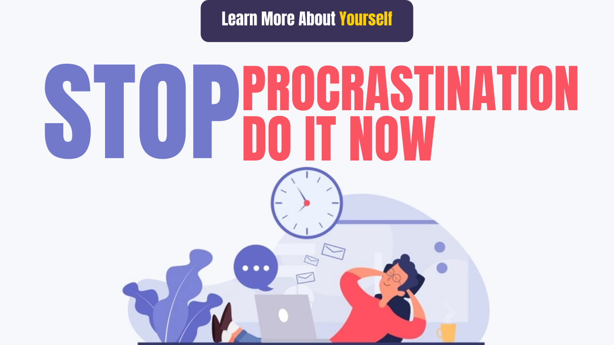

# Stop procrastination, Do It Now

Social media and cheap internet have hacked the minds of people in a way and now both children and youngsters get distracted very soon.

Students keep postponing their assignments and projects due to frequent destructions.

And this trend of postponing work is spreading fast among the people.

This tendency of avoiding work is called Procrastination. Procrastination is becoming a very big problem today,

People often lose their lives due to procrastination.

So, let&#39;s start, let&#39;s know what is procrastination according psychologically?

**The work that is to be done at the time, not doing that work at that time, postpone to do that work further, is called Procrastination.**

If it is the goal of a person to lose weight,

And he is thinking daily here that I will join gym from tomorrow, start exercising tomorrow.

If a person wants to write his book and thinks that he will start writing from tomorrow, I will start writing from tomorrow.

All these are examples of procrastination. Examples of this type are found in every field.

Postpone work by not taking such instant action is the biggest hallmark of procrastination.

This shows that procrastination leads to the loss of both time and energy.

Now after this, we get to know about some of the disadvantages caused by procrastination, let&#39;s discuss some side effects of procrastination.

## Side effects of procrastination

### Number 1.

Due to procrastination, there is a lot of waste of time, which can be settled in working hours, we deal with that work in many days of avoiding and a lot of time is consumed in doing the same work.

Thus procrastination is a time destroyer.

### Number 2.

Because of procrastination, we leave the same work tomorrow and we are left engrossed in one work and there is no time left to do the other work.

By doing this, we are not able to do a single job properly and at the right time.

That is, Procrastination promotes work delaying.

### Number 3.

Procrastination also creates a kind of mental stress.

Suppose you have been assigned a task and you are not able to complete it till the end of this month, due to which the whole month is spent in doing the same work and the assignment does not complete.

Because of this, stress and tension are also created.

This means that procrastination increases stress and anxiety manifold.

### Number 4.

Our productivity is reduced due to procrastination.

Due to lack of good productivity, we give very few results with more time.

Look like this

## Procrastination is the killer of productivity.

After knowing the bad effects of procrastination

**Let us know how we can avoid procrastination?**

Admittedly Procrastination is a serious problem, but it is also not that we cannot avoid Procrastination. Many people who suffer from this problem of postponement work, spend a lot of time avoiding work.

Procrastination is a kind of mental disability, which reduces the ability to work and also the quality of work.

In the battle between Procrastination and you, you have to have Procrastination, some surefire missiles that can destroy the army of Procrastination.

**Number 1.**

## Strong will power

You must have strong willpower to beat procrastination.

Strong willpower will give you victory in your battle with Procrastination.

When you bring the idea in your mind that you have to finish every task by a certain time, then Procrastination which has become your habit, it weakens your willpower again and again, but it does not stick in front of strong will power. Finds

So once you have decided, then stay on that decision. Gradually, a lot of work will be done to finish the work by a fixed time.

**Number 2.**

## Divide and win

If your mind considers long work burdensome, then you divide that work into small segments and then make a goal to complete those small segments, by doing this, long and difficult tasks can be done easily without postponing It will be done and you will win.

Many times this happens, even if you look at easy work together, it seems very difficult and heavy, but divide it into small parts, then the work starts to seem very easy and simple.

Therefore, try to divide the work into smaller parts.

**Number 3.**

## Use 5-second rule

According to the author of The 5-second rule, Mel Robbins, if you have to do something and your mind is trying to postpone that work, then you can try this 5-second rule.

Implementing the 5-second rule is very easy. You just need to take some instant action.

Whenever your mind is making excuses for doing that work, immediately count up to 5-4-3-2-1 in your mind and start thinking about it without thinking of anything as soon as you reach 1.

Doing this will prove to be very beneficial for you and you will soon come out of a serious problem like Procrastination.

**Number 4.**

## Reward yourself

When you complete one of your tasks, then give yourself a reward, which can give you happiness.

As a Reward you can talk to your friend, you can enjoy any of your favorite dishes. Anyone can listen to music.

The human brain is also excited for such a small reward and good feel hormones are released in the brain, which inspires to complete the work.

In this way, you can break your habit of procrastination.

**Number 5.**

## Recognize the value of time.

Time is the greatest asset in this universe, once this wealth of time is destroyed, time cannot be regained again.

Therefore, recognize the value of time and take it seriously.

Tomorrow, don&#39;t get caught up in the day after tomorrow, start working on your task, project, goal as soon as possible.

If we look hard, our life is not much, we spend 20 years studying and the rest 5-6 jobs are left in jobs and settlement, in this way, our time is quite limited, and in this time We have to do very valuable work.

**Stop procrastination**