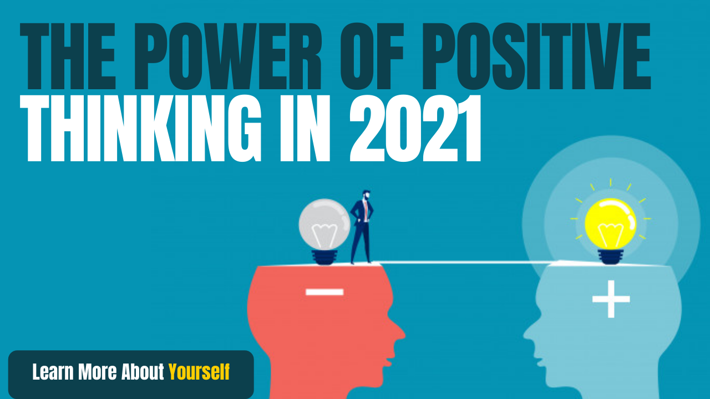

# The Power of Positive Thinking in 2021

## Power of Positive Thinking

No matter how intelligent you are, without positive thinking and a positive attitude you cannot get as much success as you want. There is a euphoria of positive thinking in making your life successful in every field. As you think you become

Once 2 friends went to a wedding. They were given a cold drink. The glass of cold drink was only half full. The first friend said that my glass is half empty. The other said, let&#39;s have fun with half a glass of cold drink.

Friends, this thing looks very small but tells us everything about our perspective. Our gaze is towards lack or good. If we continue to see the glass half empty, we will never be able to move forward in life. Whatever we get, we will remove the deficiency in it. It is evil with every good in the world. We have to make our lives ourselves. The first step for this is to &quot;see the good in everything&quot; See the Goodness of the Universe.

Initially, we will not see goodness. There is no need to worry.

Whenever a bad idea comes for someone, see that there will be some good or bad with many evils in it.

A bad watch also tells the correct time 2 times a day.

We all have the same problem when we watch a good video, we get positive thinking but in a short time negative thinking comes again.

We all know that if the water has to be raised, it takes a lot of hard work. The motor has to be installed. But when the water has to be brought down, turn the bucket upside down.

Similarly, when we want to teach our Mind something good or change our Old Thinking, the Mind does not accept it easily but when we do the same kind of work continuously, then the mind also gets to understand and that Change takes place.

It will take time to change the old thinking, but do not give up, keep trying.

Positive thinking develop Some ways to think positively

## Positive Thinking

**1. Viewing Positive videos, Motivational Videos**

a) You become as you see and hear, so never watch videos and news that create negativity.

b) After a year you will be the same as you read videos, books, and news.

c) Just watching positive video and news is not enough but negative video and news

D) And don&#39;t look at T.V Serials at all.

**2. Have at least one page in a day Motivational books**

a) U can win you can win

b) Enchantment of big thinking

c) Who will cry when you die

d) You can heel your life you can heal your life

3. Sit alone for at least 10 minutes a day to see what you have done throughout the day and how it can be made better.

4. Repeat Motivational Quotes at bedtime and wake up in the morning.

5. Make a habit of feeling small but not just saying thanks. If anyone does anything good with you, thank him from the heart.

6. Spend some time in nature. Whenever you are sad, sit for some time in a garden and watch. After some time you will feel fresh.

7. Keep company with positive thinking people - Just like we have friends, our life becomes so that by staying with positive thinking people, our thoughts also become positive.