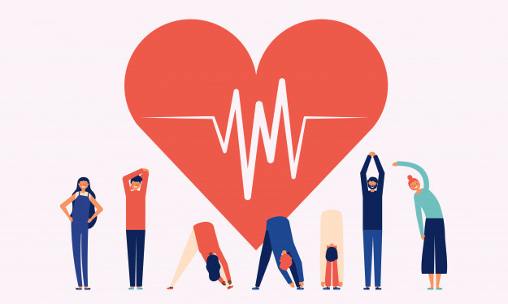

# Tips To Set You On The Path To A Better Life

Hi and welcome back to [learn more about yourself](https://learnmoreaboutyourself.com/)! Tips To Set You On The Path To A Better Life

## First Start with a Morning Routine

First of all, before you start your daily activities, you should eat a filling and healthy breakfast, whether it means work or other personal duties. Just the act of making foods can help you get into the right mindset to accomplish your goals for the day that you have the energy of your whole day.

When you are planning your day, start in the evening and go back this gives you the structure you need to accomplish everything without front-loading your tasks front, and today is the easiest and best way, plus it allows you to have a stable and regular morning routine that is not interrupted in any a rush s or assignments.

## Focus On the Little Things

When you’re creating an idea for [self-improvement](https://www.classycareergirl.com/2017/10/7-steps-for-getting-your-life-on-the-right-path/), it can be tempting to induce right into tackling the largest problems in your life and fixing them. Try to resist this urge! It’s definitely necessary to handle the massive the big holding you back, however spending all of your time on these problems may be a direction for exhaustion and burnout.

You need to pace yourself! you will not forever be within the right place to focus on huge things, and that’s okay. Small accomplishments, like cleaning your room or getting to the gymnasium, are worth focusing on and celebrating just as much as the large ones. Recognizing this can be one of the most effective ways in which to keep your morale and motivation up, which may be a huge part of improving your life., as long as you’re consistently making progress. Slow and steady wins the race, and that’s very true once it involves self-improvement.

## Connect With the right people

nowadays we all need people to help us on the way, whether or not that’s in a very direct method like a partner or co-worker, or simply as a support system to stay us motivated and catch us if we stumble. Even simply having somebody around who believes in you'll be enough to stay personality away and encourage you to succeed in larger heights.

## Path to a Better Life

Things in our lives don't always go the way we expect them to. As you continue your journey of self-reformation, you're likely to encounter some unforeseen difficulties. However, you'll assume that having issues can really end up being an opportunity for change.

You need to be flexible and open to the probabilities in front of you, no matter what path you're feeling you need to take. Getting out of your comfort zone could be a nice ability, and it'll really help you as you work to enhance your life.
