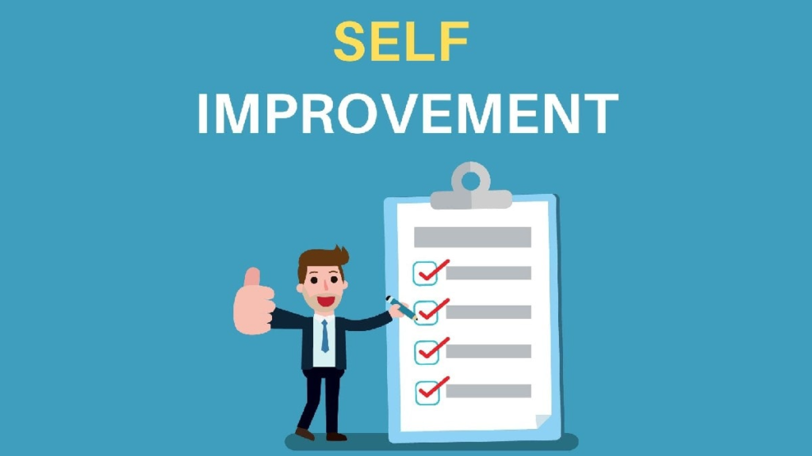

# Top 5 Practical Self-Improvement Tips 2021

Hi and welcome back to [learn more about yourself](https://learnmoreaboutyourself.com/)! Always remember overcoming your mistakes is one of the most effective practical self-improvement tips.

## Always Read Books

Books provide a wealth of knowledge. The more you read, the more you understand the world, the more you understand the meaning of the words in the books, the more you will be inspired to move forward in life. these Books are an excellent source of information of all time.
I recommend reading books that will help you enrich yourself. Here is a list of the top 5 books you read:

- Think and Rich Rise by Napoleon Hill
- Eff Extremely Effective People Stephen R. Covey's 7 Habits
- Thinking fast and slow by Daniel Kahneman
- Design Your Life: Create a life that works for you by Bill Burnett (Best one).
- Al the Lucmist Paulo Coelho

These books will transform you into a really good person as well as inspire you to do something good in life.

## Always Do Something New

The most common suggestions that come to my head are learning a new language, starting a new hobby, taking up a new course basically something that elevates your skills.

My main languages are Hindi and English. Out of interest, I started learning Punjabi and realized that learning a new language and understanding the culture could be an impressive experience!

If that’s not one thing that interests you, you must begin with an old hobby or choose a new one. It may well be something from playing golf to cooking.
If you’re somebody who wants to be smarter, I like to recommend taking up a new course that’ll assist you to gain knowledge in your space of interest.

begin with workshops and seminars before signing up for a long-term course. This way, you’ll be ready to gauge your interest early and register for a course you actually feel passionate about.

As an author, I ensure that I take up new courses to enhance my writing. think about what skills are you able to work on and start from there.

## Always Overcome Your Fears

This is one of the most usually overlooked [self-improvement tips](https://theselfimprovementblog.com/10-practical-self-improvement-tips/). we all have fears however we should overcome them in order to grow. rather than running away from them, you should begin seeing them as a compass for your growth.

Your fears are waiting to be addressed and once you are doing, you may be ready to grow into a better and stronger person.

If you have got a fear of water, take up swimming lessons. It’ll be exhausting however once you get the hang of it, you’ll conquer it in no time.

## Always Start Your Day Early

While waking up at 4-5 am isn’t extremely necessary, I think waking up at 6 am can improve the quality of your life.

If you head to sleep by 10-11 pm and awaken by 6 am, you’re increasing your productivity hours. you have an ample amount of your time to get a head start and collect your thoughts.

I’ve made it a habit to not look into my phone for an hour when I wake up. I prefer to sit down with my cup of coffee, arrange my day, write my to-do list, and water my plants. This helps ME keep relaxed and focused throughout the day.

## Always Knowledge And Work On Your Flaws

We all have flaws and the best thing we can do about them is to accept them, understand them, and work on them.

Mistakes can make you fail in the long run if not taken care of properly and can also bring a lot of trouble in life. Here are some examples of common mistakes in your daily life:

- Being a part of poor/unhealthy relationships
- Spending time with the wrong kind of people
- Not taking proper care of your physical, mental, and emotional health
- Constantly thinking/talking negatively
- Daydreaming and procrastinating

always remember overcoming your mistakes is one of the most effective [self-improvement tips](self-help-and-self-improvement-strategies).
