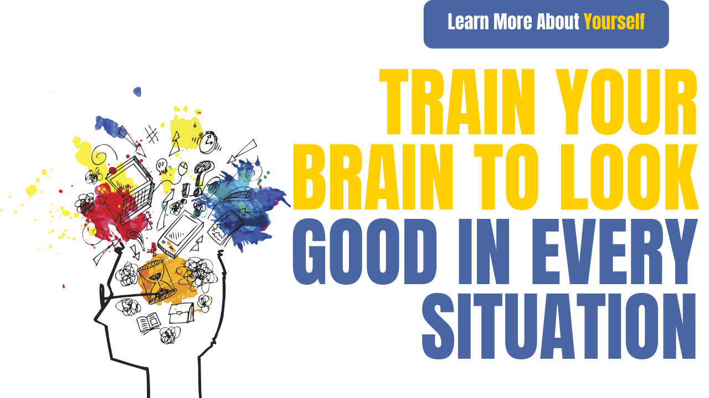

# Train your brain to look good in every situation

If we have success in the work that we want to do in life, then our mind should be trained in such a way that we can see good in every situation and get success in our work.

The most important to face any situation is whether we are able to see both sides of that situation or not, if we are able to see it then we can easily understand and solve it.

If we really want our brain to see everything well in every situation, then there are three such things that we have to keep working on, it can be said that our energy will remain and any kind of problem, we will be very Can solve easily, problems will come, just the attitude of looking at it will change.

- Body
- Intellect
- Emotion

If we really have to keep our mind right (trained) in life, then we will have to keep working on these three aspects till death, if we are not able to work properly on one of these three aspects, then the result will be Happiness, sorrow, good, bad.

When we start working closely on these three and take care of these three, then we do not need to do anything extra, the energy (self-confidence) in us will start increasing on its own.

## Body

First of all we have to keep our body fit means that we have to work well for at least 1 hour a day on top of our body, then this body will remain fit, because only a healthy body can give good life.

We have to keep our body fit because both our mind and our body are not separate, both of them are interconnected.

Whenever we have a physical problem, our mood automatically starts to deteriorate and on the other hand, when we are completely healthy, then at that time our mood automatically starts getting better, Therefore, your body also affects your mental state.

This is the aspect of our life that is most important for us and our mind and nobody really gets attention towards it.

Our mind does not really know what is right and what is wrong, but if we start telling it to him, then he automatically starts getting into that mold.

The brain is like a child that we have to explain and when we keep explaining it slowly, then it starts doing it the way we want to.

When the body becomes fully fit, then our mind automatically becomes calm so that we can face every situation very easily.

## Intellect

Whatever work we are doing or planning to do in life, the planning that happens for it is &quot;with wisdom&quot; because we cannot take any decision by being emotional, or decisions taken in anger are also often They are proved to be wrong and if they make a decision by being very positive, then they are always wrong because at that time we will see only one side of that work and will not see the other side so that it will go wrong.

Whenever we are in this stage of life, that is, in life, we have to decide for ourselves at every step, then at this time we do not have to be emotional, we have to understand things with our mind and then decide.

If once our mind goes into a state of &quot;parity&quot; then it becomes very easy for us to take decisions in any situation and then we can think well for ourselves.

## Emotion

The energy that we need for doing any work, we get it from emotion because if we look at the emotion then it is hidden within it, which makes us do any work.

Actually, there is no energy without emotion because no logic works on our emotional side.

If we know that it is not right for me to do this work, but when emotions come upon us, then we start doing that work on our own, no matter how wrong it is for us, we keep doing it. It is known that these emotions really control our lives.

What is this emotion? There are some chemical releases inside our mind when we do something in which we feel good and then our mind needs the same thing back, due to which these emotions dominate us all the time and whose Because of this, we are doing any work wrongly or looking wrongly.

Emotion does not matter what is right for you and what is wrong, what he has to do, he has to do, how to do it will be the same as our values ​​are lying.

This is why we neither think well nor see any good in any situation in life, just get carried away in emotions.

To avoid this emotional side, we have to keep control over our emotions so that we can think something for ourselves and do something good for ourselves, we have to write a story for ourselves only then something new can happen to us.

In today&#39;s time, according to what is happening in the outside world, we are going to act and keep going more and more.

In fact, if we see the door of our life in someone else&#39;s hand, we go on doing the same thing as we want and then we keep crying later, so if we work well on these three things, then we can do any of life One can take positive decisions on time so that there will be disappointment at any time, whether the work is successful or unsuccessful.

Whatever work we want to do in life, if we start to enjoy doing that work, then whatever we want to achieve, we will start getting it ourselves.

And once we start working on all three aspects, then we are giving our brain training after which it will look good for every situation.