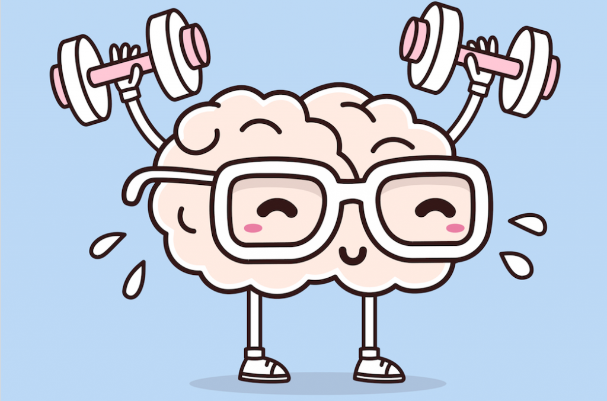

# Ways To Keep A Sharp Brain At Any Age

## Always Play brain games

Stop at any discount retail store, pharmacy, or grocery, and you’ll see the popularity of puzzle books. Crossword puzzles, word finds, brainteasers, and logic problems will help you check your memory, knowledge, and demanding thinking skills. Sudoku – the extremely popular logical grid game that originated in Japan – has international appeal partially due to its use of numbers rather than letters. The game has shown to be restful as well as [boost brain](happiness-6-easy-tips-and-it-can-be-yours) performance, reasoning, and help keep people mentally sharp.

## Let's Get moving

The daily workout will help stave off dementia. So whatever activity you enjoy, like walking, dancing, or joining a community sports team to keep you moving, could be a nice plan. You don’t need to begin coaching for the athletic contest, either – simply adding steps to your day will help. Studies show those who walk 7,500 steps daily or less than four miles of walking. Will reduce brain aging by over 2 years. Exercise gets a lot of blood flow to the brain, reduces stress hormones, and helps reduce inflammation – all important ways that to stay your [brain healthy](https://www.webmd.com/brain/features/keeping-your-brain-fit-for-life#1).

## Reduce stress

When we’re under stress, the body releases a hormone known as cortisol to help us manage the stressor in a physical manner. As well as heightening our senses and emotional adrenaline. However, the buildup of cortisol within the brain will have negative long impacts. As well as killing brain cells and shrinking the size of our brains. The great news is simply about everything else on this list will help you to reduce your cortisol and cut the impacts of stress.

## Always get meditating

meditation will preserve the volume of brain grey matter in long meditators. Even those who had not to meditate for a long time showed higher brain volume over people who didn't meditate in the least. It doesn’t take much. People have noted improvements in just some days, so though you've got a short attention span, it’s worth an attempt.

## keep social

Staying connected – and not just on the internet means – can be great for your brain health. Age-relate psychological feature decline is going to be counteracted by regular social interaction. That has intellectual stimulation, which is more like fights stress and depression. Even those while not a big difference or family nearby will benefit by turning into connected in their communities. Be part of a club, participate in native events, and look into special interest groups in your area.
