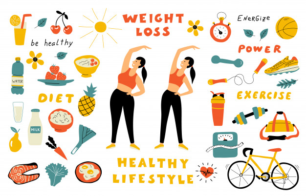

# Weight Loss Tips For Healthy For Women

Hi and welcome back to [learn more about yourself](https://learnmoreaboutyourself.com/)! Many women nowadays are struggling with healthy weight loss which is normal, and your own health journey is comparable to the men in your life that you must know, which is why things become frustrating. And with many weight loss issues and confusion

Recommendations Finding out how to maintain your health while losing pounds may seem impossible.

Luckily, there are resources like self-improvement weblogs that can help keep you in touch for health and wellness during a whole new method. In addition, the [following tips](https://www.healthline.com/nutrition/weight-loss-for-women) can help you understand whether men and girls have completely different weight loss experiences. How important disease prevention is to weight loss, and how to change your diet and fitness routines to enhance your overall quality of life.

As a woman, you will understand that your male friends appear to be dropping empty pounds, while you can spend weeks in the gym without seeing noticeable results. Will this means that you’re doing one thing wrong? No, not at all! In reality, it is much more common for men to lose weight than girls, simply because of biology.

So Healthgrades states that women naturally have higher levels of body fat than men - this can be the result of women using less fat for fat once they rest while no one is aware of it. So, losing weight more slowly than male fitness enthusiasts is nothing short of stressful. Focusing on your own personal goals will get you away.

## Weight Loss Exercise

If you definitely want to reduce weight. It's very important to exercise, particularly if you're hoping to exercise and get stronger. By investing in a gymnasium membership you may have access to all types of equipment and fun fitness classes that you simply can understand from the trainer there.

typically it should be that for a few reasons it's not possible to join the gymnasium. Perhaps you live too far away from the closest gymnasium, otherwise. You do not have the money to pay the monthly membership fee. Don't worry, you don't have to be part of a gymnasium to stay refreshed. As an example, you'll be able to contact your friend who is also trying to slim to discuss the possibility of working together and holding each other accountable at your homes.

You can commit to a fitness challenge that may be completed at home like the 50 arms exercises Daily 28-day Challenge. Taking part in this challenge will help you make healthy food selections, work on a daily basis, and be dedicated to overcoming obstacles. You will also want to invest in a fitness tracker - you can keep track of your progress.

## weight-reduction plan.

Although you don’t have to give up all of your favorite foods to lose weight. You can’t rely on exercise alone to lose weight. So reducing your calories and treating unhealthy behaviors for more nutritious choices could be a good alternative. But, the idea seems awkward - after all, isn’t it hard to stay on a diet within the long run? It all depends on however you approach these changes. With the proper strategy, you'll avoid a lot of the difficulties that women usually experience when diet.

If you want to ensure that you just can commit to your new eating habits for the predictable future, this is also a compromise. You must avoid trying crash diets which will leave you hungry and tired. Instead, try eating lots of fiber, protein, and healthy fats to feel full. Focus on incorporating more flavorful ingredients into your meals, like fresh herbs, spices that fill the punch, and home-baked dressings and sauces that are delicious as well as therapeutic.

you'll keep a food diary to make sure you're getting all the vitamins and minerals you need. That you'll keep on your mobile so that you'll keep it everywhere. And once daily, if you eat a healthy diet on a daily basis. Treat yourself to at least one of your favorite desserts. And once you see the results when trying these remedies. You'll be glad that you simply made these changes and you succeeded too.
