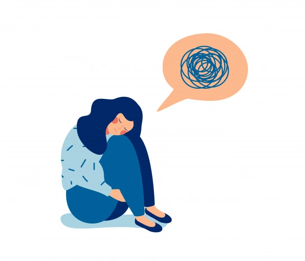

# What About Seasonal Depression?

So what we started with is still helpful to start with a short definition to make sure everyone is on the same page. Seasonal emotional disorder, also known as S.A.D. Also known as it is a seasonal form of [depression](how-loss-and-grief-affect-normal-life) that attacks most minorities at certain times of the year.

So the most common time to suffer from this seasonal depression is during the cold, obscure and excessive rains and winter months. S.A.D. It's still a study in progress, but thanks to some of the suspected perpetrators of the change of mood you can see below:

- Endocrine changes.
- Imbalance of melatonin levels.
- Leads.
- Lack of vitamin D absorption leads to a decreased supply of mood-regulator serotonin

People who have S.A.D. Most of those struggling with are women, although some men are also definitely affected. The number of SAD cases during the colder months also goes to geographical areas with intense sunlight and a significant lack of sunlight for part of the year which is very bad news.

SAD symptoms may include the following, but are not limited to:

- Stress
- Anxiety
- Asleep
- Restlessness
- The desire for loneliness.
- Significant irritability.
- Persistent low mood.
- Frustration prolonged scarcity.
- Difficulty concentrating.
- Fatigue regardless of sleep.
- In extreme cases, suicidal thoughts.

Each of these symptoms, although primarily mental in nature, can eventually have profound reactions to your physical health as well as your emotional well-being, which is normal.

## Professional Help

Lastly, if you're feeling that your seasonal [depression](https://www.healthline.com/health/depression) struggles are profound, don't hesitate to achieve out to a health professional to facilitate. this will be a preliminary step, like contacting a health educator to find out more regarding your options.

However, if you are feeling you need more important help, visit your doctor to check if you would like a medical prescription, to help with the symptoms of depression.
