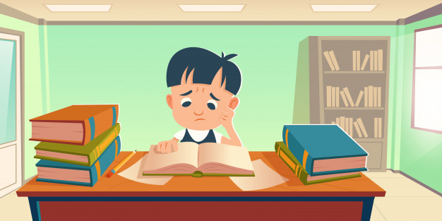
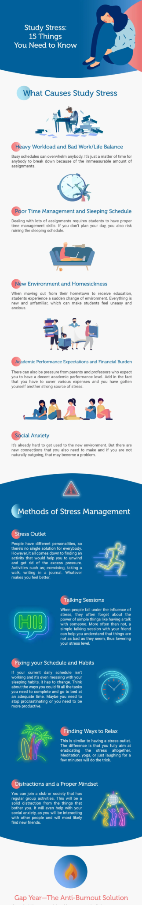

# What About Study Stress?

Stress is not always negative. There are two types of stress, which we will discuss in full below.

Positive stress, also called eustress, keeps us [motivated](how-to-work-on-your-self-confidence) which is good for you. So retrace plays an important role in maintaining our sense of well-being, encouraging us to achieve our important goals and helping us stay healthy which is a good thing. For example, maybe during your first day at school, after a good gym training, on a first date, or a place where you have any work for the first time, etc.

Worse, this negative stress or distress makes us feel irritated, nervous, angry, and depressed. This can give you a lot of trouble in your daily life. This type of stress has a negative effect on our mental and physical health from which you cannot do your job well. It also reduces student performance and reduces your ability to work with the pressure of studying at a college. Teachers give 2 to 3 times more work than the capacity of the student and the teachers pressurize him to complete it in a short time which has a big impact on the mental health of the student which is a very bad thing.

To help you differentiate between urethra and distress, we've compiled a list of negative stress symptoms. Check more information:

## Physical symptoms:

- Fatigue
- Headaches
- Stomach aches
- Low energy
- Muscle aches
- Insomnia
- Nausea, vomiting, diarrhea

## Mental symptoms:

- Altered eating habits
- Sadness
- Sense of isolation
- Anxiousness
- Anger
- Lack of concentration
- Irritability
- drowsiness during day hours
- Troubles with falling asleep at night

The constant pressure will cause serious health issues. the most effective way to deal with study stress is to learn to be told a lot regarding stress management techniques and find out what works for you. That’s why we’ve ready an infographic that examines the foremost common causes of [study stress](https://www.lonsdaleinstitute.edu.au/blog/reduce-stress-while-studying/#:~:text=While%20learning%20new%20things%20is,with%20your%20other%20life%20commitments.) and provides advice on a way to facilitate yourself after you expertise stress.

If you continue to cannot get a summons to review and are constantly bored of getting up in class within the morning, you would possibly need to take a year faraway from school. during this infographic, you may also get the benefit of taking a gap year.

## Infographic on Study Stress

