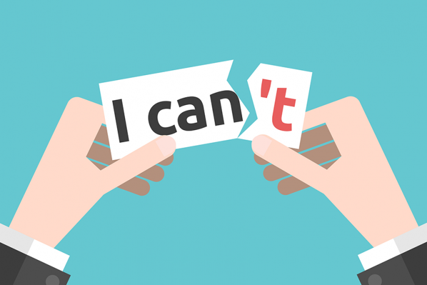

# What is Confidence? – How To Boost

[Confidence](https://www.usf.edu/student-affairs/counseling-center/top-concerns/what-is-self-confidence.aspx#:~:text=Self%2Dconfidence%20is%20an%20attitude,assertively%2C%20and%20can%20handle%20criticism.) demonstrates your ability and skill. This means that you accept and trust and have a sense of control in your life. You have a positive outlook if you know your weaknesses and strengths. You set realistic expectations and goals, communicate with certainty, and control criticism.

Your low self-esteem towards others makes you feel full of self-doubt, and makes you submissive to it, feeling confident in others. The feeling of self-confidence in you may depend on the situation. For example, you may feel very confident in some areas, such as scholars, but lack confidence in others, such as relationships.

Having high or low self-confidence is rarely related to your actual abilities, and mostly based on your assumptions. The way you think about yourself is the way it is and these thoughts can be flawed.

Low self-esteem can be overcome by different experiences, such as growing up in an unsatisfactory and critical environment, being separated from your friends or family for the first time, judging yourself too harshly, or fearing failure. People with low self-esteem often have errors in their thinking.

## How to boost your confidence

- Recognize and emphasize your strengths. Reward [yourself](https://learnmoreaboutyourself.com/) for your progress and efforts and praise yourself.
- When you encounter obstacles, treat yourself with kindness and compassion. Don’t focus on failure.
- Set realistic and achievable goals. Don’t expect perfection; It is impossible to be perfect in every aspect of life.
- When you feel intense, slow down and think logically about the situation.
- The challenge of making assumptions about yourself, people, and situations.
- Recognize that past negative life experiences do not indicate your future.
- Express your needs, beliefs, and feelings directly and respectfully
- Learn to reject unreasonable requests.
- Personal counseling can also help boost your confidence if you need more help.
