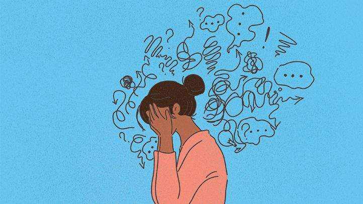

# What is Depression? – Signs and Symptoms

[Depression](http://www.ulifeline.org/topics/128-depression) is a medical condition that can affect a person's ability to function, study, communicate with people, or take care of themselves. Many of us have felt sad or lonely at times. When sadness becomes too much to handle, or lasts too long, it can be a sign of frustration. Depression is a medical condition that can affect people's ability to function, study, communicate with people, or take care of themselves. This may be due to an imbalance in brain chemistry. But it can also be exacerbated by [stress](what-about-study-stress), poor nutrition, physical illness, personal loss, and school or relationship difficulties.

Not everyone experiences depression in the same way. Depressed people may withdraw and become frustrated, or they may become aggressive and self-destructive. Some people may be frustrated about a particular problem, while others may be frustrated without knowing why. The common thread, however, is the overwhelming, constant feeling of despair.

Depression affects approximately 19 million people in the United States each year. Depression can be a one-time event in times of stress, or it can recur throughout a person's life. The first episodes of depression often appear during the young years.

## Signs and Symptoms

Frustration is not always easy to see. Some people experience primarily behavioral changes, some experience mostly emotional changes, and others primarily experience physical changes. Here are some warning signs that a person may become indifferent:

- Constant sadness, restlessness, irritability, or empty mood
- Loss of interest in previously enjoyable activities
- Withdrawals from friends and family
- Difficulty falling asleep or sleeping too much
- Fatigue and reduced energy
- Significant changes in appetite and/or weight
- Exaggeration on criticisms
- Feeling unable to meet expectations
- Difficulty concentrating, remembering details, and making decisions
- Feelings of worthlessness, despair, or guilt
- Persistent physical symptoms such as headaches, digestive problems, or chronic pain that do not respond to regular treatment
- Substance abuse problems
- Thoughts of suicide or attempted suicide
- Getting help

The good is that depression is very treatable. There are many available methods for treating depression, including medications and/or counseling. 90 and 80% of people who experience depression experience significant improvement and almost all individuals get some relief from their symptoms. It is important to understand that depression lasts for months, or even years if left untreated. So, If you or someone you know may be frustrated, contact your school's health center. The health center may associate you with a physician or group consultation.

People who are indifferent think about suicide. It is important to seek immediate help if you or someone you know is having these thoughts.
