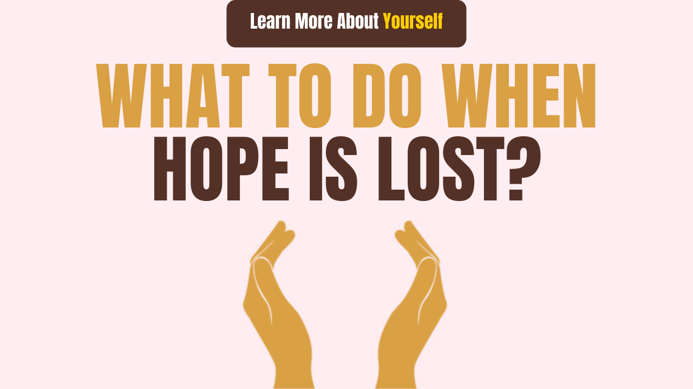

# What to do when hope is lost?

Are you going through a situation in your life where you feel that all the circumstances are against you?

And feeling stuck in life,

And lost all hope?

You are not the only one who is struggling with this situation.

This happens to everyone at some time when such things start happening suddenly when our confidence in ourselves arises and hope does not appear anywhere.

This happens when we lose someone when our environment in which we are accustomed to living, there is some change in it and all the things start to reverse completely from our expectations.

What we want should happen, it does not happen. We get stuck at a place from where we don&#39;t see anything ahead. But no matter how bad the situation may be, we should hold the door of hope and we should not think that what we have now will never go away.

No matter how bad the time is? In every situation there is a possibility of hope, there is a ray of hope, which keeps looking at us. We should trust that silver lining all the time.

In this post, we will get some suggestions that will help us regain hope, and will fill a new wave of excitement in our life.

## What is the expectation?

Hope is the expression of our confidence, which is the basis of a lot of practical nature, such as patience, determination, and courage. Their basic point is the expectation.

Expectation provides us with a goal, then also provides motivation to achieve that goal.

## Why is there hope in our life?

To live a meaningful and purposeful life, enthusiasm is always needed and hope is needed to create and sustain this enthusiasm.

If we want to live meaningfully, then we need a partner like this for hope.

Hope produces the courage we need to face challenges.

Hope promotes optimistic thinking.

Hope helps us formulate new strategies.

Hope helps us to remain firm in the field until the game makes the right turn.

How to recover from lost hope?

## How to Recover and Kindle Hope

If we are a Ludo player, if any Got get cut while playing the game, then we think that if we do not run this bet, then the Got could have survived.

By the way, we should never give up hope.

Hope is lost, then we can recover hope again by using some technique.

Here are some suggestions.

### 1. Express your feeling,

The best way to express your feeling is by writing, it is very good to express your feelings by writing. For this, we can write a personal journal daily. In which we can write small incidents that happen to us every day. Which helps us recover hope.

What to do when you lose hope? never lose hope in life

For this, it is also necessary that we can write a personal blog, and share it with people, we can write the events happening in our daily life.

Or we can also express our feeling on any social media such as Instagram.

And hope will come back to life again.

### 2. Find a community

When hope is lost in life and darkness is seen everywhere, then being alone increases the agility, while when living among people, being part of a community, then we recover hope again.

And it is easier when we live with people who are facing the same problems as us. When someone tells us how he got out of this situation by dealing with it, then we are inspired by his stories, it helps us recover the lost hope.

### 3. Think for yourself a bigger picture, and connect yourself to the bigger goal

When we focus on our immediate problems and see how things are going against us, it becomes more difficult to find hope in our lives.

And it is also said that whatever we focus on, it starts to grow.

But when we think about our big picture and any big life goals, then we again have hope, which inspires us.

And there is a ray of hope within us that even after this dark night one morning will come, which will convert our dreams, our vision into reality.

### 4. Re-live memorable moments

There are some moments in everyone&#39;s life, when we remember that a long smile comes on our face, when we are going through a bad time, then it is important that we remember that moment of our life After that, live the experiences of that moment, live it again.

Doing this helps us regain our lost expectations.

And we are able to establish ourselves once again.

### 5. Do something different

Another way to get hope is to try something different.

For this, it is necessary that we change our daily routine, and the environment in which we are living, it needs to change. For this, we can go to a new place, see beautiful places, scenery and meet new people.

We can spend some time reviving our expectations. We should also spend some time with nature, which has a positive effect on both our body and mind. It also reduces stress, provides relief in depression and envy.

### 6. Read Biography and Autobiography

Reading about any big man makes us stronger from within, and strengthens our mindsets. Before becoming great, every great leader is like a normal human being, they also have troubles and troubles in life, they too have to face many kinds of torture.

For example, Nelson Mandela lived in a black cell for 14 years, still did not let his movement stop, fight, then one day he came to be able to liberate his country from the British.

What the British did not do to break Mahatma Gandhi, to weaken his morale,

But he did not kneel in front of the British, kept fighting, fighting, and forced the British to leave the country.

When we read the biography of Steve Jobs, we see how an undergraduate boy opens the company with a vision, launches his products, the company even runs, but then he is removed from his own company.

But where they are going to stop, they seem to make another company successful.

We also get inspiration from all these people and we achieve the lost hope in our life.

### 7. Share Your Story with People

When we are going through bad times, then it is important that we share our stories with our partners, friends, counselor.

Tell them about your mental environment.

When we are going through such a situation, then it is very important that someone sympathize with us.

In such a situation, people also help, we stand with us, we also get emotional support, due to this emotional support, we again get our hopes.

### 8. Do not be alone.

When we are going through bad times, then we make the biggest mistake that people get cut off, they start living alone.

While we should not do this, being isolated from people creates more negative thoughts in us, being alone also brings frightening scary thoughts, which raise the stress level higher.

In this situation, being in the midst of people, living among loved ones helps us to get out of hard times. And very soon we recover from bad times and life becomes the same as before.

### 9. Exercise and meditation.

When we are troubled by the mind, then the mind also gets corrected by working with the body. We can do exercises to work on the body.

When you have lost hope, then it is important that we do some work with the body, keep ourselves busy, keeps us busy, helps us a lot.

Exercise keeps the metabolism of the body right, and good feel hormone is also released in the body, which makes us feel good.

Just this one task gives us more than 70% mood correct.

Having lost hope, something cannot be understood, at that time we start exercising only, work on our body and get a lot of help, and very soon we will take control of the situation.

Along with this, if we start mediation also, then we will get more help.

Meditation has its own distinct advantages.

To know more about Meditation, you can read our article

The amazing benefits of meditation

### 10. Spend time with children

There are many benefits of spending time with children, the child&#39;s naughty style, cheerful mood, open heart behavior also helps us to overcome problems to a great extent.

And it is also said that we should keep the child inside us alive,

#### Why is it called?

Because children are the most beautiful creation of this universe and we get a different style from them.

Everything is in play for us in childhood and we take everything lightly, laugh at something, laugh with heart, weep even if we cry.

There is a completely different style of that time.

Some things change as they get older.

So it is very important that some time play with children, spend time with them, become some fun,

By doing this we can revive the expectation easily.

### 11. Write a journal.

Writing Diary is a very powerful fund, by writing a journal we can express our feelings very easily, and get to know our mind beyond the deep level.

By which we say thinking, it is actually on autopilot mode, there are also two ways of thinking,

One is when we think about something by doing labor, second is that we go without thinking without any labor.

This is another type of thinking, it is very dangerous.

This causes a lot of our energy waste.

There is a fact about the mind, the mind alone consumes 25% of energy.

And when we write the thoughts that are going on in the mind, then we are able to master our thinking.

When we understand our thinking pattern, we can also control it. And avoid getting caught in negative thinking patterns.

And if our mind will think positive, then a ray of hope will be seen on its own.

In this way, we can achieve hope by adopting all the ways mentioned above, control our minds and become positive, strong human beings from the inside.

Under no circumstances should a man give up hope