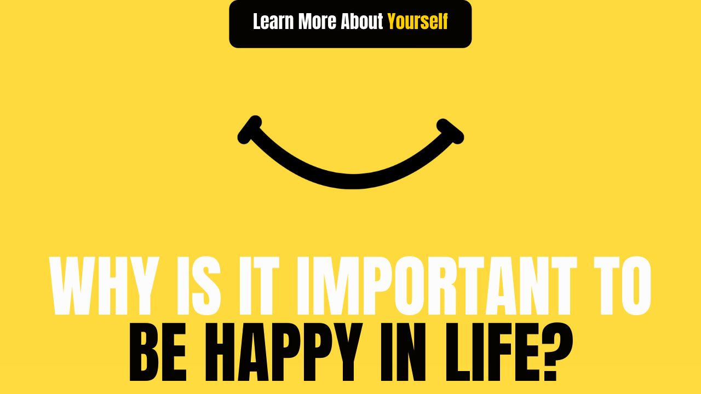

# Why is it important to be happy in life?

Time is like a flowing river, from childhood to childhood and when old age comes from youth, it is not known. In life, whether you diving in this river or not, it keeps going like a flowing river. Whether life has passed unhappily or is happy, it is in our hands. One should always be happy thinking that whether we live or not the next moment, we should definitely be happy at this moment.

We get an equal amount of happiness and sorrow in life, but we find the duration of happiness short and the duration of grief too much because good time goes out very quickly and bad time hurts us and we feel that it comes out of great difficulty. Used to be.

We have many conditions to be happy with a life like if I get this job then I will be happy, I will be happy if I get married, I will be happy if I have children, I will be happy if I get a good friend I will be, I will be happy if I get a good boss, I will be happy if my illness is cured, I will be happy if I become rich and there are many other conditions that we keep in front of life sometimes. A condition is fulfilled, but many conditions are not fulfilled, then we get frustrated and saddened to think that there are miseries in my life.

One thing in life should not be the basis of our life that without it we would not be happy. Life is very long and there is a lot we can do in this, only need is to keep our spirits up and live life with positive thinking.

There can be a hundred reasons to be unhappy in life, but the only reason is enough to be happy, the person who knows himself to be happy, the same person knows how to keep other people happy too.

Every person gets grief in different forms in life, these problems can be occupational, family, and health-related and we cannot run away from these troubles, we can be unhappy during these troubles, we can suffer from stress and depression. And if we wish, we can also happily compromise with these troubles.

Do you think that happiness and sorrow are in this environment that comes whenever we want? Actually, it is not so. Happiness and sorrow are both in our minds, if we want, we can be happy in one moment and we can be sad the next. Our thoughts of happiness and sorrow in our life. We are saddened by our thoughts. Only in a single moment can you be happy by changing your thoughts.

Today, life has become like a video game, whose level is getting harder and harder. Today, if you look back in your life, you will see that you have left behind mountains of sorrow and bad times, and how many mountains of grief are yet to be climbed. Remember the worst time of your life that even if that time is not there, it will not be that time and make your life happy with this thought.

By seeing good and positive thoughts in our mind, we can make our life happy by living unhappily or by being happy. It will pass so it is good that why not live this moment happily.