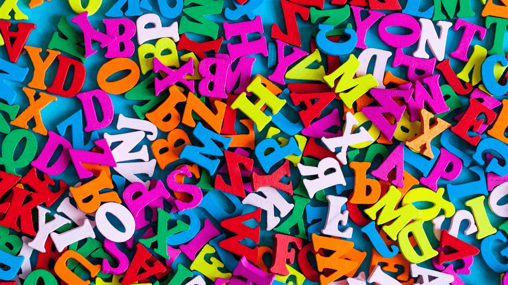

# Words That Make Other People Feel Inferior

Did you know that in every language, there are as many positive or as many negative words? It seems like we need a lot of words to describe our [negative emotions](top-5-practical-self-improvement-tips-2021), but we are satisfied with the positive ones.

For example, researchers have found that most cultures have [words](https://www.entrepreneur.com/slideshow/307643) for seven basic emotions: joy, fear, anger, sadness, disgust, shame, and guilt.

 

 
It is a positive emotion and six negative emotions.

 
It is no surprise that many of us have had a difficult time considering our negative comments. I am reporting verbal language that I am using that I do not realize hurts others and in some cases, they feel secondary. I have also noticed that I have used the couple on my personal and business website.

This post will list the negative words that you should avoid so that you stop hurting, belting, and intimidating the people around you.

- In the way
- Failure
- No
- Fool
- Irresponsible
- Dumb
- Can’t
- Bad
- Ashamed
- In the way
- Incompetent